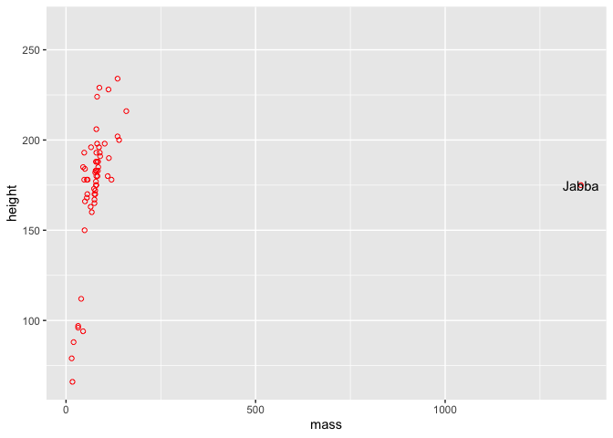
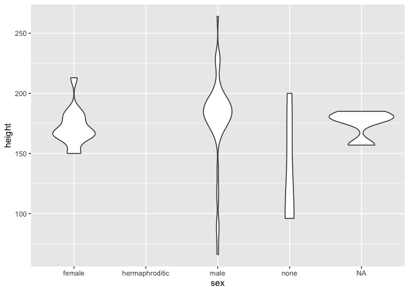
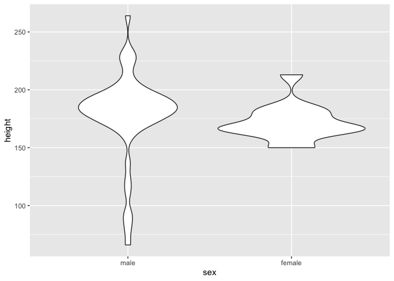

Day 1 Hands-on-Biomedical-Data
================
Daniel Katzlberger
2023-11-27

The output is suppressed for all the not so interesting calls

# Basics

Load required packages

``` r
require(tidyverse)
require(pheatmap)
require(gemma.R)
```

## Variables

``` r
a <- 1
b <- 3
typeof(a)
typeof(b)
str(a)
str(b)
a
b
```

## Functions

``` r
sum(a, b)
a + b
sum(5,6)
c <- sum(a, b)
(c <- sum(a, b))
str(c)
sum(a,c)
```

``` r
a <- "abc"
b <- "hello"
sum(a, b)
```

    ## Error in sum(a, b): invalid 'type' (character) of argument

``` r
typeof(a)
typeof(b)
str(a)
str(b)

a <- TRUE
b <- FALSE
sum(b, b)
sum(a, a)
typeof(a)
typeof(b)
str(a)
str(b)
```

## Vectors

``` r
vec <- c(1,2,3,4,1,2,3)
names(vec) <- LETTERS[1:4]
str(vec)
sum(vec)
mean(vec)
vec[2]
vec[3]
vec[6] # exceeding the range of the names, there is no value names
vec["A"]
vec[c("A", "D")]
unique(vec)
unique(names(vec)) # each index with no name is assigned <NA>
1:10
-5:5
vec <- 10:1
vec[2:3]
```

Creating my own vector with the letters `B`, `C`, `D`

``` r
?LETTERS
your.vector <- LETTERS[2:4]
print(your.vector)
```

    ## [1] "B" "C" "D"

``` r
stopifnot(your.vector == c("B", "C", "D"))
```

## Lists

``` r
list_x <- list("a", 1, "b", "xyz", TRUE)
str(list_x)
list_x[1]
str(list_x[[1]])
str(list_x[1])
list_x[[2]]
list_x[2:4]
str(list_x[2:4])
vec_x <- c("a", 1, "b", "xyz", TRUE)
str(vec_x)
```

## Loops and conditions

``` r
for(x in 1:6){
    print(paste("x =", x)) # this is like f string in python
    if(x > 3){
        print("...x is greater than three")
    }
    if(x == 2){
        print("...x equals two")
    }
    if(x != 4){
        print("...x is not four")
    }
    if(x %% 2 == 0){
        print("...x is even")
    } else {
        print("...x is uneven")
    }
    if(x %in% c(3,5)){
        print("...x is three or five")
    }
    print("-------")
}
```

# Visualizations

## Matrices

Load the data into R

``` r
m <- readRDS("data.RDS")
```

Summarize the matrix

``` r
str(m)
dim(m)
head(m)
row.names(m)
colnames(m)
1:20
dim(m)
dim(m[1:20,])
```

Get the colnames with `"Liver_Fibroblasts"` in the name

``` r
colnames(m)
grepl("Liver_Fibroblasts", colnames(m))
dim(m)
dim(m[, grepl("Liver_Fibroblasts", colnames(m))])
```

Subset first 20 rows of `m` containing `"Liver_Fibroblasts"` and rename
cols and rows

``` r
m <- m[1:20, grepl("Liver_Fibroblasts", colnames(m))]
colnames(m) <- gsub("^Liver_Fibroblasts_(.+)_RNA_(\\d)$", "\\1_\\2", colnames(m))
print(colnames(m))
```

    ##  [1] "IL6_2"  "TGFb_3" "TNF_1"  "IFNa_2" "PBS_1"  "IFNa_3" "TGFb_1" "IL3_1"  "IL3_3"  "IL6_1" 
    ## [11] "PBS_3"  "IL3_2"  "IL6_3"  "IFNa_1" "TGFb_2" "TNF_2"  "PBS_2"  "IFNg_2" "IFNg_3" "IFNg_1"

``` r
row.names(m) <- paste0("g", 1:nrow(m))
print(row.names(m))
```

    ##  [1] "g1"  "g2"  "g3"  "g4"  "g5"  "g6"  "g7"  "g8"  "g9"  "g10" "g11" "g12" "g13" "g14" "g15"
    ## [16] "g16" "g17" "g18" "g19" "g20"

`m`looks now like this

``` r
print(m)
```

    ##     IL6_2 TGFb_3 TNF_1 IFNa_2 PBS_1 IFNa_3 TGFb_1 IL3_1 IL3_3 IL6_1 PBS_3 IL3_2 IL6_3 IFNa_1
    ## g1   1668    111     6      3  1981   7024     11     4  6775    13   302  1614   418      7
    ## g2      0      0     0      0     0      0      0     0     0     0     0     0     0      0
    ## g3      0      2   224      0     0      0      0     0  1956     0     1     0     1      0
    ## g4      0      0     0      0     0      0      0     0     0     0     1     0     0      0
    ## g5      0   1639     0   7602  3222  17104   1509    40  1311  1238  1579  3643   622      6
    ## g6    712      0     0      0     1      0      1     1     0     2     0   589     0      1
    ## g7     12      5     0      1    15      3      5     0     7   930  4400     3    82      5
    ## g8   1495     15  1392  12620  4074     21     37    60  2619 19716    14   433  2792     48
    ## g9      0      4     4      0    29      0      2     0   530     0     1     1     1      0
    ## g10  1409    589  2331   5359   835   1923    799     3  2816  1617     1   593   808   3141
    ## g11    22      0     0      0     1      0      0     0     0     1     0     0   296      0
    ## g12     0      0     0      0     0      0      0     0     0     0     0     0     0      0
    ## g13     0      0     0      0     0      0      0     0     0     0     0     0     0      0
    ## g14     3      0     0      0     1      0      0     0     0     0     0     0     0      0
    ## g15     0      0     0      6     0      0      0     0     0     0     0     0     0      0
    ## g16     0      0     0      0     0      0      0     0     0     0    14     0     0      0
    ## g17     1      8     1    382     2     99      2     1     1     1     2  1854     1      3
    ## g18  1183      0     9     39     3    143      1     1     3  1478    44     1     2      4
    ## g19  2845   2327    14      0   656    112      1     0  1021  3058   152     0    15      0
    ## g20     2      0     1      0     0      0      0     0     0   387     1     3     1      0
    ##     TGFb_2 TNF_2 PBS_2 IFNg_2 IFNg_3 IFNg_1
    ## g1    3034    28     2      1     32      0
    ## g2       0     0     0      0      0      0
    ## g3       0     0     0      0      0      0
    ## g4       1     0     0      0      0      0
    ## g5    3966  5084    60      0      0   2424
    ## g6      96     1     0      0      0      0
    ## g7       5    12     8      0      0      1
    ## g8      16    58     9      1    403   1332
    ## g9      10     3     0      0    169    140
    ## g10      2   289     5   4764   1786    518
    ## g11      0     0     1      0      0      0
    ## g12      0     0     0      0      0      0
    ## g13      0     0     0      0      0      0
    ## g14    769  2267     1      0      0      0
    ## g15      0     0     0      0      0      0
    ## g16      0     0     0      0      0      0
    ## g17      1     5     1      0    344    548
    ## g18     41  3055    33      0     44      2
    ## g19     29     3     1      3   1764     62
    ## g20      3     0    49      0      0      0

It is possible to transpose the matrix `t()`

``` r
t(m)
```

Now we correlate the genes

``` r
cor(m, method="spearman")
```

    ##            IL6_2    TGFb_3     TNF_1    IFNa_2     PBS_1    IFNa_3    TGFb_1     IL3_1     IL3_3
    ## IL6_2  1.0000000 0.4348869 0.5429904 0.3336479 0.6574785 0.5747640 0.5039096 0.4930959 0.4699791
    ## TGFb_3 0.4348869 1.0000000 0.5993691 0.5657252 0.8176152 0.7942448 0.8301574 0.5496666 0.8864129
    ## TNF_1  0.5429904 0.5993691 1.0000000 0.3852197 0.5150741 0.5125420 0.4796276 0.4356716 0.7799199
    ## IFNa_2 0.3336479 0.5657252 0.3852197 1.0000000 0.6617169 0.7801724 0.7560388 0.8042615 0.6025343
    ## PBS_1  0.6574785 0.8176152 0.5150741 0.6617169 1.0000000 0.8228649 0.9256020 0.7337127 0.7926782
    ## IFNa_3 0.5747640 0.7942448 0.5125420 0.7801724 0.8228649 1.0000000 0.8419110 0.7663434 0.7725496
    ## TGFb_1 0.5039096 0.8301574 0.4796276 0.7560388 0.9256020 0.8419110 1.0000000 0.8027482 0.8021524
    ## IL3_1  0.4930959 0.5496666 0.4356716 0.8042615 0.7337127 0.7663434 0.8027482 1.0000000 0.6215490
    ## IL3_3  0.4699791 0.8864129 0.7799199 0.6025343 0.7926782 0.7725496 0.8021524 0.6215490 1.0000000
    ## IL6_1  0.7953701 0.6344723 0.5566010 0.6163911 0.7679195 0.7855093 0.7321110 0.6602058 0.6079393
    ## PBS_3  0.3662759 0.6953074 0.4105859 0.5171648 0.6384832 0.7611022 0.6739363 0.4435738 0.6849037
    ## IL3_2  0.3995727 0.5923300 0.3429666 0.7010652 0.6972578 0.6992501 0.8519163 0.8319654 0.5700174
    ## IL6_3  0.6214578 0.7700799 0.6226622 0.6523170 0.8369677 0.7751217 0.7754319 0.6272770 0.8162670
    ## IFNa_1 0.5649770 0.6196038 0.4251822 0.8481801 0.7807117 0.8223180 0.8864373 0.8980587 0.6950226
    ## TGFb_2 0.5648214 0.4736229 0.2554340 0.3638878 0.7408117 0.6041665 0.6583348 0.5927917 0.4684664
    ## TNF_2  0.5398926 0.5947639 0.3825822 0.6844834 0.8478941 0.7890697 0.7983979 0.7121321 0.6260553
    ## PBS_2  0.5742788 0.4791517 0.3757792 0.6347800 0.6552976 0.7236760 0.6047479 0.5696043 0.4863112
    ## IFNg_2 0.7188270 0.6927770 0.6942680 0.3917934 0.6359939 0.6122911 0.5520573 0.4834521 0.6854266
    ## IFNg_3 0.6104677 0.6740706 0.8154327 0.5008748 0.6993256 0.6422748 0.6508811 0.5165986 0.6824755
    ## IFNg_1 0.2989485 0.7570871 0.4995310 0.7136015 0.7903718 0.7207854 0.8269174 0.6016993 0.6564858
    ##            IL6_1     PBS_3     IL3_2     IL6_3    IFNa_1    TGFb_2     TNF_2     PBS_2    IFNg_2
    ## IL6_2  0.7953701 0.3662759 0.3995727 0.6214578 0.5649770 0.5648214 0.5398926 0.5742788 0.7188270
    ## TGFb_3 0.6344723 0.6953074 0.5923300 0.7700799 0.6196038 0.4736229 0.5947639 0.4791517 0.6927770
    ## TNF_1  0.5566010 0.4105859 0.3429666 0.6226622 0.4251822 0.2554340 0.3825822 0.3757792 0.6942680
    ## IFNa_2 0.6163911 0.5171648 0.7010652 0.6523170 0.8481801 0.3638878 0.6844834 0.6347800 0.3917934
    ## PBS_1  0.7679195 0.6384832 0.6972578 0.8369677 0.7807117 0.7408117 0.8478941 0.6552976 0.6359939
    ## IFNa_3 0.7855093 0.7611022 0.6992501 0.7751217 0.8223180 0.6041665 0.7890697 0.7236760 0.6122911
    ## TGFb_1 0.7321110 0.6739363 0.8519163 0.7754319 0.8864373 0.6583348 0.7983979 0.6047479 0.5520573
    ## IL3_1  0.6602058 0.4435738 0.8319654 0.6272770 0.8980587 0.5927917 0.7121321 0.5696043 0.4834521
    ## IL3_3  0.6079393 0.6849037 0.5700174 0.8162670 0.6950226 0.4684664 0.6260553 0.4863112 0.6854266
    ## IL6_1  1.0000000 0.6288575 0.6295450 0.8176368 0.7374441 0.5896401 0.6435070 0.8244142 0.6400996
    ## PBS_3  0.6288575 1.0000000 0.5247848 0.6472630 0.5809907 0.5138720 0.5606094 0.6214251 0.3681631
    ## IL3_2  0.6295450 0.5247848 1.0000000 0.6105370 0.8467234 0.6192688 0.6586399 0.6344409 0.2998441
    ## IL6_3  0.8176368 0.6472630 0.6105370 1.0000000 0.7253836 0.4448471 0.6123073 0.7743046 0.6219044
    ## IFNa_1 0.7374441 0.5809907 0.8467234 0.7253836 1.0000000 0.5599275 0.7637019 0.6606893 0.5132797
    ## TGFb_2 0.5896401 0.5138720 0.6192688 0.4448471 0.5599275 1.0000000 0.8221912 0.6047925 0.3289536
    ## TNF_2  0.6435070 0.5606094 0.6586399 0.6123073 0.7637019 0.8221912 1.0000000 0.7002955 0.3956877
    ## PBS_2  0.8244142 0.6214251 0.6344409 0.7743046 0.6606893 0.6047925 0.7002955 1.0000000 0.3450439
    ## IFNg_2 0.6400996 0.3681631 0.2998441 0.6219044 0.5132797 0.3289536 0.3956877 0.3450439 1.0000000
    ## IFNg_3 0.5996161 0.4226578 0.4311593 0.5902852 0.5108325 0.3462808 0.5376188 0.3473701 0.7514603
    ## IFNg_1 0.6582256 0.5976030 0.6252866 0.6813676 0.6350575 0.4454264 0.7094061 0.5655394 0.3948306
    ##           IFNg_3    IFNg_1
    ## IL6_2  0.6104677 0.2989485
    ## TGFb_3 0.6740706 0.7570871
    ## TNF_1  0.8154327 0.4995310
    ## IFNa_2 0.5008748 0.7136015
    ## PBS_1  0.6993256 0.7903718
    ## IFNa_3 0.6422748 0.7207854
    ## TGFb_1 0.6508811 0.8269174
    ## IL3_1  0.5165986 0.6016993
    ## IL3_3  0.6824755 0.6564858
    ## IL6_1  0.5996161 0.6582256
    ## PBS_3  0.4226578 0.5976030
    ## IL3_2  0.4311593 0.6252866
    ## IL6_3  0.5902852 0.6813676
    ## IFNa_1 0.5108325 0.6350575
    ## TGFb_2 0.3462808 0.4454264
    ## TNF_2  0.5376188 0.7094061
    ## PBS_2  0.3473701 0.5655394
    ## IFNg_2 0.7514603 0.3948306
    ## IFNg_3 1.0000000 0.7099875
    ## IFNg_1 0.7099875 1.0000000

``` r
p <- pheatmap(cor(m, method="spearman"))
p
```

<!-- -->

Here the diagonal is set to `<NA>`

``` r
cMT <- cor(m, method="spearman")
diag(cMT) <- NA

p <- pheatmap(cMT)
p
```

<!-- -->

Subsetting the matrix for 30 rows and first 10 columns

``` r
m1 <- readRDS("data.RDS")
```

``` r
m1 <- m1[1:40, grepl("Liver_Fibroblasts", colnames(m1))] # i take 40 rows to later subset 30
colnames(m1) <- gsub("^Liver_Fibroblasts_(.+)_RNA_(\\d)$", "\\1_\\2", colnames(m1))
row.names(m1) <- paste0("g", 1:nrow(m1))
```

``` r
dim(m1)
```

    ## [1] 22055   230

``` r
matrix.check <- m1[1:30,1:10]
stopifnot(all(dim(matrix.check) == c(30,10)))
dim(matrix.check)
```

    ## [1] 30 10

## Data frames and dplyr

``` r
starwars
str(starwars$name)
```

Check uniqueness of names in the data

``` r
stopifnot(length(unique(starwars$name))==nrow(starwars))


sw <- starwars |> 
    select(where(function(x) !is.list(x))) |> 
    as.data.frame()

sw |> count(homeworld) 
```

    ##         homeworld  n
    ## 1        Alderaan  3
    ## 2     Aleen Minor  1
    ## 3          Bespin  1
    ## 4      Bestine IV  1
    ## 5  Cato Neimoidia  1
    ## 6           Cerea  1
    ## 7        Champala  1
    ## 8       Chandrila  1
    ## 9    Concord Dawn  1
    ## 10       Corellia  2
    ## 11      Coruscant  3
    ## 12       Dathomir  1
    ## 13          Dorin  1
    ## 14          Endor  1
    ## 15         Eriadu  1
    ## 16       Geonosis  1
    ## 17    Glee Anselm  1
    ## 18     Haruun Kal  1
    ## 19        Iktotch  1
    ## 20       Iridonia  1
    ## 21          Kalee  1
    ## 22         Kamino  3
    ## 23       Kashyyyk  2
    ## 24      Malastare  1
    ## 25         Mirial  2
    ## 26       Mon Cala  1
    ## 27     Muunilinst  1
    ## 28          Naboo 11
    ## 29      Nal Hutta  1
    ## 30           Ojom  1
    ## 31        Quermia  1
    ## 32          Rodia  1
    ## 33         Ryloth  2
    ## 34        Serenno  1
    ## 35          Shili  1
    ## 36          Skako  1
    ## 37        Socorro  1
    ## 38        Stewjon  1
    ## 39        Sullust  1
    ## 40       Tatooine 10
    ## 41       Toydaria  1
    ## 42      Trandosha  1
    ## 43        Troiken  1
    ## 44           Tund  1
    ## 45         Umbara  1
    ## 46         Utapau  1
    ## 47        Vulpter  1
    ## 48          Zolan  1
    ## 49           <NA> 10

Add column with firstname

``` r
sw <- sw |> 
    mutate(firstname = str_remove(name, " .+$")) 
```

### Exercise 1.1

``` r
sw |> count(gender)
```

    ##      gender  n
    ## 1  feminine 17
    ## 2 masculine 66
    ## 3      <NA>  4

``` r
sw |> count(skin_color)
```

    ##             skin_color  n
    ## 1                 blue  2
    ## 2           blue, grey  2
    ## 3                brown  4
    ## 4         brown mottle  1
    ## 5         brown, white  1
    ## 6                 dark  6
    ## 7                 fair 17
    ## 8  fair, green, yellow  1
    ## 9                 gold  1
    ## 10               green  6
    ## 11         green, grey  1
    ## 12    green-tan, brown  1
    ## 13                grey  6
    ## 14          grey, blue  1
    ## 15 grey, green, yellow  1
    ## 16           grey, red  1
    ## 17               light 11
    ## 18               metal  1
    ## 19       mottled green  1
    ## 20                none  2
    ## 21              orange  2
    ## 22                pale  5
    ## 23                 red  1
    ## 24    red, blue, white  1
    ## 25         silver, red  1
    ## 26                 tan  2
    ## 27             unknown  1
    ## 28               white  2
    ## 29         white, blue  2
    ## 30          white, red  1
    ## 31              yellow  2

``` r
sw |> 
    pull("skin_color") |> 
    str_split(", ") |> 
    unlist() |> 
    table() |> 
    sort()
```

    ## 
    ##  brown mottle          gold     green-tan         metal mottled green        silver       unknown 
    ##             1             1             1             1             1             1             1 
    ##          none        orange           tan        yellow          pale           red         brown 
    ##             2             2             2             4             5             5             6 
    ##          dark         white          blue         green         light          grey          fair 
    ##             6             7             8             9            11            12            18

The difference is that the strings, that contain more than one color are
split into their individual colors. Therefore, not counted as an extra
color.

### Exercise 1.2

``` r
tallcharacters <- sw |> 
    filter(height > 200) |> 
    pull(name)
```

### Exercise 1.3

Pipe 1

``` r
start.time <- Sys.time()
starwars |> 
    filter(hair_color == "blond") |> 
    filter(sex == "male")
```

    ## # A tibble: 3 × 14
    ##   name      height  mass hair_color skin_color eye_color birth_year sex   gender homeworld species
    ##   <chr>      <int> <dbl> <chr>      <chr>      <chr>          <dbl> <chr> <chr>  <chr>     <chr>  
    ## 1 Luke Sky…    172    77 blond      fair       blue            19   male  mascu… Tatooine  Human  
    ## 2 Anakin S…    188    84 blond      fair       blue            41.9 male  mascu… Tatooine  Human  
    ## 3 Finis Va…    170    NA blond      fair       blue            91   male  mascu… Coruscant Human  
    ## # ℹ 3 more variables: films <list>, vehicles <list>, starships <list>

``` r
end.time <- Sys.time()
time.taken1 <- end.time - start.time
```

The function filter is called twice in this pipe. <br> Pipe 2

``` r
start.time <- Sys.time()
starwars |> 
    filter(hair_color == "blond" & sex == "male")
```

    ## # A tibble: 3 × 14
    ##   name      height  mass hair_color skin_color eye_color birth_year sex   gender homeworld species
    ##   <chr>      <int> <dbl> <chr>      <chr>      <chr>          <dbl> <chr> <chr>  <chr>     <chr>  
    ## 1 Luke Sky…    172    77 blond      fair       blue            19   male  mascu… Tatooine  Human  
    ## 2 Anakin S…    188    84 blond      fair       blue            41.9 male  mascu… Tatooine  Human  
    ## 3 Finis Va…    170    NA blond      fair       blue            91   male  mascu… Coruscant Human  
    ## # ℹ 3 more variables: films <list>, vehicles <list>, starships <list>

``` r
end.time <- Sys.time()
time.taken2 <- end.time - start.time
```

Here the function filter is not called twice but within filter two
conditions are set and combined with `&` meaning `hair_color` must be
blonde and `sex` must be male.

``` r
print(c(time.taken1,time.taken2))
```

    ## Time differences in secs
    ## [1] 0.10013390 0.08578801

Second pipe executes faster <br> Pipe 3

``` r
starwars |> 
    filter(hair_color == "blond" | sex == "male")
```

    ## # A tibble: 60 × 14
    ##    name     height  mass hair_color skin_color eye_color birth_year sex   gender homeworld species
    ##    <chr>     <int> <dbl> <chr>      <chr>      <chr>          <dbl> <chr> <chr>  <chr>     <chr>  
    ##  1 Luke Sk…    172    77 blond      fair       blue            19   male  mascu… Tatooine  Human  
    ##  2 Darth V…    202   136 none       white      yellow          41.9 male  mascu… Tatooine  Human  
    ##  3 Owen La…    178   120 brown, gr… light      blue            52   male  mascu… Tatooine  Human  
    ##  4 Biggs D…    183    84 black      light      brown           24   male  mascu… Tatooine  Human  
    ##  5 Obi-Wan…    182    77 auburn, w… fair       blue-gray       57   male  mascu… Stewjon   Human  
    ##  6 Anakin …    188    84 blond      fair       blue            41.9 male  mascu… Tatooine  Human  
    ##  7 Wilhuff…    180    NA auburn, g… fair       blue            64   male  mascu… Eriadu    Human  
    ##  8 Chewbac…    228   112 brown      unknown    blue           200   male  mascu… Kashyyyk  Wookiee
    ##  9 Han Solo    180    80 brown      fair       brown           29   male  mascu… Corellia  Human  
    ## 10 Greedo      173    74 <NA>       green      black           44   male  mascu… Rodia     Rodian 
    ## # ℹ 50 more rows
    ## # ℹ 3 more variables: films <list>, vehicles <list>, starships <list>

Here the conditions are combined with `|` meaning or/oder. This pipe
prints all rows either with the `hair_color` blond or with `sex` male.
\### Exercise 1.4

``` r
sw <- sw |> 
    mutate(bmi = mass/(height/100)^2)
```

Look at the quartiles of the `bmi`column

``` r
quantile(sw$bmi, na.rm = TRUE)
```

    ##        0%       25%       50%       75%      100% 
    ##  12.88625  21.51109  24.67038  26.60305 443.42857

``` r
# data.frames are lists, thus the same syntax with two squared brackets works
quantile(sw[["bmi"]], na.rm = TRUE)
```

    ##        0%       25%       50%       75%      100% 
    ##  12.88625  21.51109  24.67038  26.60305 443.42857

``` r
# the function 'pull' can also extract columns
quantile(pull(sw, "bmi"), na.rm = TRUE)
```

    ##        0%       25%       50%       75%      100% 
    ##  12.88625  21.51109  24.67038  26.60305 443.42857

## Plotting

``` r
ggplot(sw, aes(x=mass, y=height)) + geom_point(na.rm = TRUE)
```

<!-- -->

``` r
px <- ggplot(sw, aes(x=mass, y=height))
```

### Exercise 1.5

``` r
px + geom_hex()
```

    ## Warning: Removed 28 rows containing non-finite values (`stat_binhex()`).

<!-- -->

``` r
px + geom_point(color = "red", shape = 1) + 
    geom_text(data = sw |> filter( mass > 1000), aes(label = firstname))
```

    ## Warning: Removed 28 rows containing missing values (`geom_point()`).

<!-- -->

``` r
ggplot(sw, aes(x=height)) + geom_histogram()
```

    ## `stat_bin()` using `bins = 30`. Pick better value with `binwidth`.

    ## Warning: Removed 6 rows containing non-finite values (`stat_bin()`).

<!-- -->

``` r
ggplot(sw, aes(x=height)) + geom_density() + stat_ecdf()
```

    ## Warning: Removed 6 rows containing non-finite values (`stat_density()`).

    ## Warning: Removed 6 rows containing non-finite values (`stat_ecdf()`).

<!-- -->

``` r
sw |> 
    group_by(gender) |> 
    top_n(3, bmi) |> 
    ggplot(aes(x=fct_reorder(firstname, bmi), y=bmi, fill=gender)) + 
    geom_bar(stat="identity") +
    facet_grid(rows = vars(gender), space = "free_x", scales = "free_y")
```

<!-- -->

## Factors

``` r
ggplot(sw, aes(x=sex,y =height)) + geom_violin()
```

    ## Warning: Removed 6 rows containing non-finite values (`stat_ydensity()`).

    ## Warning: Groups with fewer than two data points have been dropped.

<!-- -->

``` r
sw |> 
    filter(sex %in% c("male", "female")) |> 
    ggplot(aes(x=sex,y =height)) + geom_violin()
```

    ## Warning: Removed 5 rows containing non-finite values (`stat_ydensity()`).

<!-- -->

``` r
str(sw$sex)
```

    ##  chr [1:87] "male" "none" "none" "male" "female" "male" "female" "none" "male" "male" "male" ...

``` r
# Here we just look at the column 'sex' and see that it is a vector of characters.
sw |> 
    filter(sex %in% c("male", "female")) |> 
    pull(sex) |> 
    str()
```

    ##  chr [1:76] "male" "male" "female" "male" "female" "male" "male" "male" "male" "male" "male" ...

``` r
# Now it is converted to a factor with the levels 'female' and then 'male'
sw |> 
    filter(sex %in% c("male", "female")) |> 
    mutate(sex = factor(sex)) |> 
    pull(sex) |> 
    str()
```

    ##  Factor w/ 2 levels "female","male": 2 2 1 2 1 2 2 2 2 2 ...

``` r
# You can choose the order of levels, which has effects on plots and other 
# functions (design matrices)
sw |> 
    filter(sex %in% c("male", "female")) |> 
    mutate(sex = factor(sex, levels=c("male", "female"))) |> 
    pull(sex) |> 
    str()
```

    ##  Factor w/ 2 levels "male","female": 1 1 2 1 2 1 1 1 1 1 ...

### Exercise 1.6

``` r
sw |> 
    filter(sex %in% c("male", "female")) |> 
    mutate(sex = factor(sex, levels=c("male", "female"))) |> 
    ggplot(aes(x=sex,y =height)) + geom_violin()
```

    ## Warning: Removed 5 rows containing non-finite values (`stat_ydensity()`).

<!-- -->

## GEMMA

### Exercise 1.7

``` r
get_datasets("HIV1", limit = 100, taxa = "human") |> 
    filter(geeq.batchCorrected == TRUE) |> 
    select(taxon.Name, taxon.ID, experiment.Accession, experiment.SampleCount)

gse <- "GSE21589"

get_datasets(gse) |> 
    select(experiment.ShortName, experiment.Name, experiment.ID, experiment.Description)

d <- get_dataset_design(gse)
str(d)
head(d)
with(d, table(batch))
row.names(d)

e <- get_dataset_processed_expression(gse)
str(e)
colnames(e)
e <- as.data.frame(e)

dataMT <- as.matrix(e[,row.names(d)])
str(dataMT)
row.names(dataMT) <- e$GeneSymbol

boxplot(dataMT, las=2)
```
