Day 2 Hands-on-Biomedical-Data
================
Daniel Katzlberger
2023-11-27

# Introduction in differential expression analysis

Load packages

``` r
require(tidyverse)
require(limma)
require(pheatmap)
require(ComplexHeatmap)
require(enrichR)
```

Load data

``` r
data <- readRDS("data.RDS") 
design <- readRDS("design.RDS") 
gmap <- readRDS("gmap.RDS") 
```

### Exercise 2.1

The `data` object is a matrix, `design` and `gmap` are dfs <br> Checking
rows and columns

``` r
dim(data)
```

    ## [1] 22055   230

22055 rows and 230 cols

``` r
dim(design)
```

    ## [1] 230   3

230 rows and 3 cols

``` r
dim(gmap)
```

    ## [1] 21923     2

21923 rows and 2 cols <br> What is contained in the object `data`

``` r
str(data)
```

    ##  num [1:22055, 1:230] 1668 0 0 0 0 ...
    ##  - attr(*, "dimnames")=List of 2
    ##   ..$ : chr [1:22055] "ENSMUSG00000000001" "ENSMUSG00000000003" "ENSMUSG00000000028" "ENSMUSG00000000037" ...
    ##   ..$ : chr [1:230] "Liver_Fibroblasts_IL6_RNA_2" "Liver_Fibroblasts_TGFb_RNA_3" "Spleen_Fibroblasts_IFNa_RNA_1" "Spleen_Epithelium_TGFb_RNA_3" ...

``` r
head(data)
```

Samples in columns, gene name in rows and the table cells contain gene
expression (RNA counts) <br> What is contained in the object `design`

``` r
str(design)
```

    ## 'data.frame':    230 obs. of  3 variables:
    ##  $ cell_type: chr  "GP38posCD31neg" "GP38posCD31neg" "GP38posCD31neg" "EPCAMpos" ...
    ##  $ stimulus : chr  "IL6" "TGFb" "IFNa" "TGFb" ...
    ##  $ organ    : chr  "Liver" "Liver" "Spleen" "Spleen" ...

``` r
head(design)
```

Cell_type, stimulus, organ columns and rows contain samples <br> What is
contained in the object `gmap`

``` r
str(gmap)
```

    ## 'data.frame':    21923 obs. of  2 variables:
    ##  $ external_gene_name: chr  "Gnai3" "Pbsn" "Cdc45" "Scml2" ...
    ##  $ gene_unique       : chr  "Gnai3" "Pbsn" "Cdc45" "Scml2" ...

``` r
head(gmap)
```

Different gene names to map

## Subsetting the data

Only working with liver_fibroblasts

``` r
sub.design <- design[grepl("Liver_Fibroblasts", row.names(design)),]
sub.design <- sub.design |> 
    filter(cell_type == "GP38posCD31neg" & stimulus == "IFNa" | stimulus == "PBS")

sub.data <- data[,row.names(sub.design)]
stopifnot(colnames(sub.data) == row.names(sub.design)) # checking if columns and rows align
```

Renaming the columns to make them easier to interpret

``` r
colnames(sub.data) <- gsub("^Liver_Fibroblasts_(.+)_RNA_(\\d)$", "\\1_\\2", colnames(sub.data))
row.names(sub.design) <- gsub("^Liver_Fibroblasts_(.+)_RNA_(\\d)$", "\\1_\\2", row.names(sub.design))
```

## Making correlation Heatmap

### Exercise 2.2

Correlating the data

``` r
corMT <- cor(sub.data, method="spearman")
diag(corMT) <- NA
heatmap(corMT, main="Correlation between liver_fibroblasts with different stimuli", symm = TRUE)
```

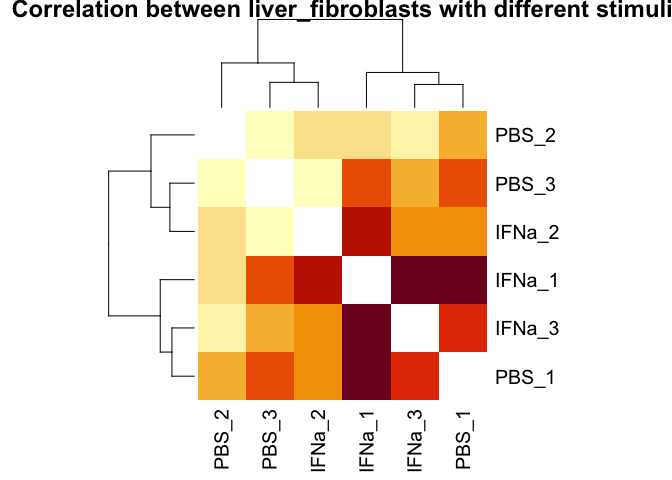<!-- -->

Looking at the heatmap the IFNa_1 highly correlates with IFNa_2 and
IFNa_3. That can be expected as the stimulus was the same. However, it
also highly correlates with PBS_1 and also shows noticeable correlation
with PBS_2. <br> \## MDS projection

``` r
data.frame(cmdscale(dist(2-corMT),eig=TRUE, k=2)$points) |> 
    add_column(stimulus = sub.design$stimulus) |> 
    rownames_to_column("sample") |> 
    mutate(sn = gsub("^.+?_(\\d)$", "\\1", sample)) |> 
    ggplot(aes(x=X1,y=X2)) + 
    geom_point(aes(color=stimulus)) + 
    geom_text(aes(label=sn), hjust = 1.5) +
    theme_bw()
```

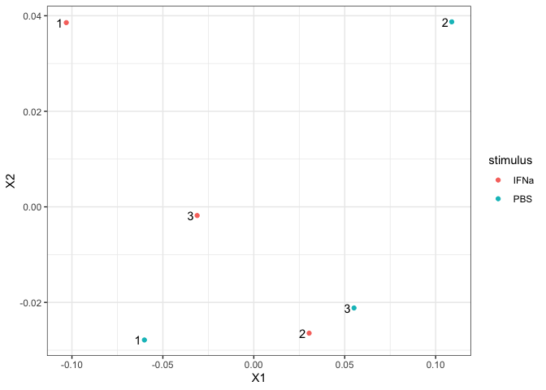<!-- -->

# Differential expression

### Exercise 2.3

Adjust the design matrix to have PBS as intercept

``` r
sub.design <- sub.design |> 
    mutate(stimulus = factor(stimulus, levels=c("PBS", "IFNa")))

model <- model.matrix(~stimulus, data=sub.design)

Heatmap(model)
```

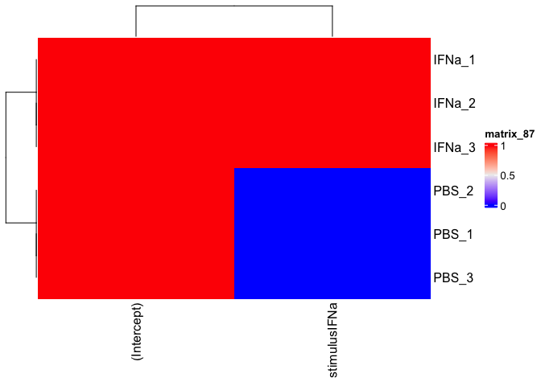<!-- -->

## Use limma voom to normalize the data

``` r
dataVoom <- voom(sub.data, design=model, plot = TRUE) 
```

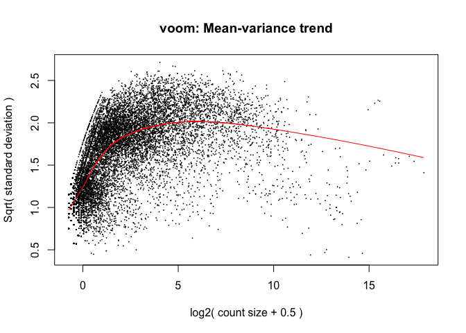<!-- -->

``` r
norm.data <- dataVoom$E
```

Types of objects

``` r
str(dataVoom)
```

    ## Formal class 'EList' [package "limma"] with 1 slot
    ##   ..@ .Data:List of 4
    ##   .. ..$ : num [1:22055, 1:6] -1.51 -4.32 -4.32 -4.32 9.57 ...
    ##   .. .. ..- attr(*, "dimnames")=List of 2
    ##   .. .. .. ..$ : chr [1:22055] "ENSMUSG00000000001" "ENSMUSG00000000003" "ENSMUSG00000000028" "ENSMUSG00000000037" ...
    ##   .. .. .. ..$ : chr [1:6] "IFNa_2" "PBS_1" "IFNa_3" "PBS_3" ...
    ##   .. ..$ : num [1:22055, 1:6] 0.0607 1.1393 1.1393 1.1393 0.0719 ...
    ##   .. ..$ : num [1:6, 1:2] 1 1 1 1 1 1 1 0 1 0 ...
    ##   .. .. ..- attr(*, "dimnames")=List of 2
    ##   .. .. .. ..$ : chr [1:6] "IFNa_2" "PBS_1" "IFNa_3" "PBS_3" ...
    ##   .. .. .. ..$ : chr [1:2] "(Intercept)" "stimulusIFNa"
    ##   .. .. ..- attr(*, "assign")= int [1:2] 0 1
    ##   .. .. ..- attr(*, "contrasts")=List of 1
    ##   .. .. .. ..$ stimulus: chr "contr.treatment"
    ##   .. ..$ :'data.frame':  6 obs. of  1 variable:
    ##   .. .. ..$ lib.size: num [1:6] 10002755 11886887 8312165 8273662 14143053 ...
    ##   ..$ names: chr [1:4] "E" "weights" "design" "targets"

`dataVoom`is a class from `limma` called `EList`

``` r
str(norm.data)
```

    ##  num [1:22055, 1:6] -1.51 -4.32 -4.32 -4.32 9.57 ...
    ##  - attr(*, "dimnames")=List of 2
    ##   ..$ : chr [1:22055] "ENSMUSG00000000001" "ENSMUSG00000000003" "ENSMUSG00000000028" "ENSMUSG00000000037" ...
    ##   ..$ : chr [1:6] "IFNa_2" "PBS_1" "IFNa_3" "PBS_3" ...

`norm.data`is a `matrix` <br>

## Plotting the data before and after normalization

``` r
boxplot(sub.data[1:30,])
```

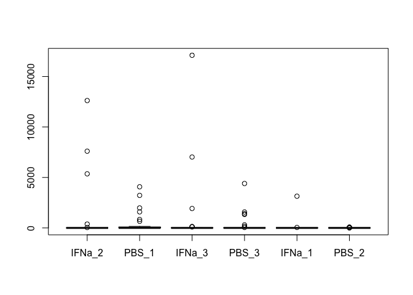<!-- -->

First code shows the gene expression per stimulus

``` r
boxplot(t(sub.data[1:30,]))
```

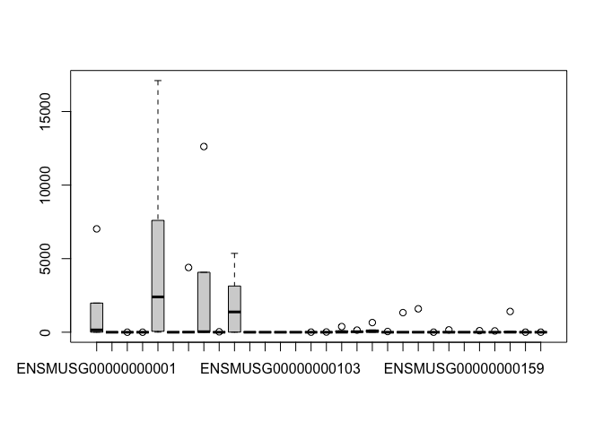<!-- -->

Second code shows the gene expression per gene <br> Doing the same for
normalized data

``` r
boxplot(norm.data[1:30,])
```

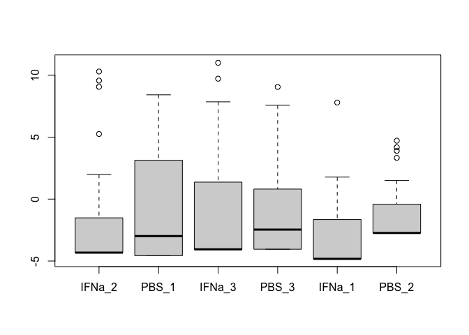<!-- -->

``` r
boxplot(t(norm.data[1:30,]))
```

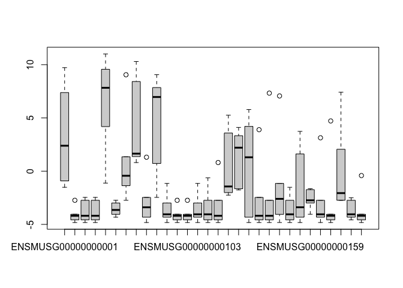<!-- -->

Variance can be better explained/seen <br> Looking at density

``` r
plot(density(data[8,]))
```

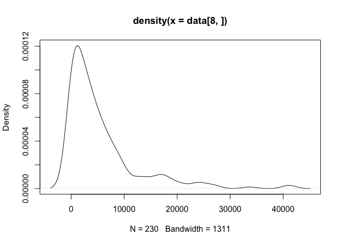<!-- -->

``` r
plot(density(dataVoom$E[8,]))
```

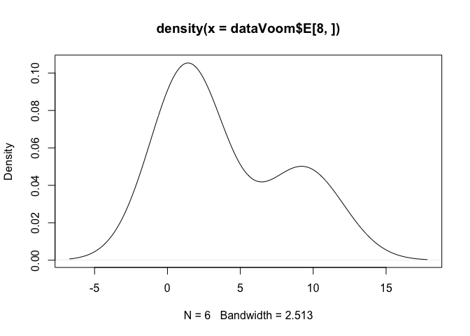<!-- -->

``` r
plot(density(log2(data[8,])))
```

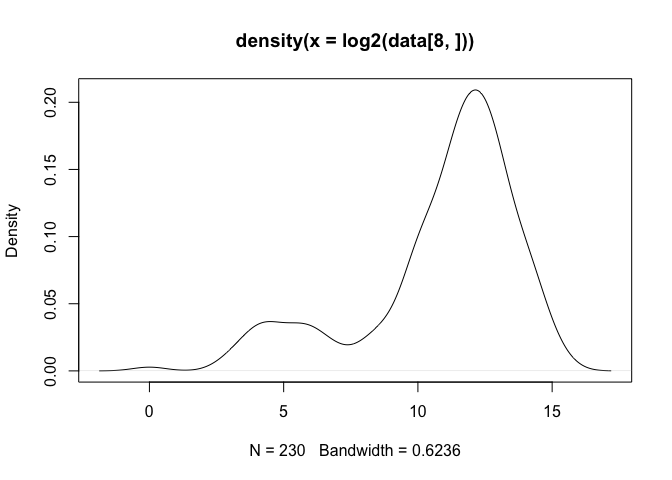<!-- -->

Distribution for the normalized data is better visible. Maybe two states
of the gene are visible

## Differential expression

``` r
limmaFit <- lmFit(dataVoom, design=model)
limmaFit <- eBayes(limmaFit)
```

Look at coeffs and store them in a list

``` r
head(coef(limmaFit)) 
```

    ##                    (Intercept) stimulusIFNa
    ## ENSMUSG00000000001    4.105909   -1.6676793
    ## ENSMUSG00000000003   -3.622527   -0.7465299
    ## ENSMUSG00000000028   -2.921889   -1.4471673
    ## ENSMUSG00000000037   -2.921889   -1.4471673
    ## ENSMUSG00000000049    6.700237   -0.3369947
    ## ENSMUSG00000000056   -3.137492   -0.8623222

``` r
limmaRes <- list()
for(coefx in colnames(coef(limmaFit))){ 
    limmaRes[[coefx]] <- topTable(limmaFit, coef=coefx,number = Inf) 
}
limmaRes <- bind_rows(limmaRes, .id = "coef")
limmaRes <- filter(limmaRes, coef != "(Intercept)")
```

# Data interpretation

## Vulcano plot

### Exercise 2.4

``` r
threshold <- abs(limmaRes$logFC) > 2 & limmaRes$P.Value < 0.05

ggplot(limmaRes, aes(x = logFC, y= -log10(P.Value), color = threshold)) +
    geom_point(alpha = 0.5) +
    scale_color_brewer(palette = "Set2") +
    theme(legend.position = "none") +
    geom_hline(yintercept = -log10(0.05)) + 
    geom_vline(xintercept = c(-2, 2)) 
```

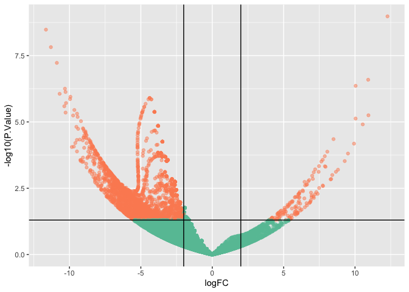<!-- -->

``` r
ggplot(limmaRes, aes(x = logFC, y= -log10(P.Value))) +
    geom_hex()
```

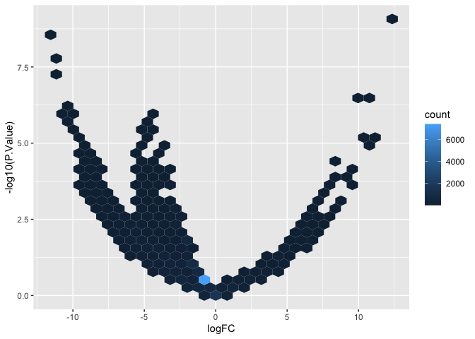<!-- -->

## P-value distribution

### Exercise 2.5

``` r
ggplot(limmaRes, aes(x=P.Value, fill=factor(floor(AveExpr)))) + 
    geom_histogram()
```

    ## `stat_bin()` using `bins = 30`. Pick better value with `binwidth`.

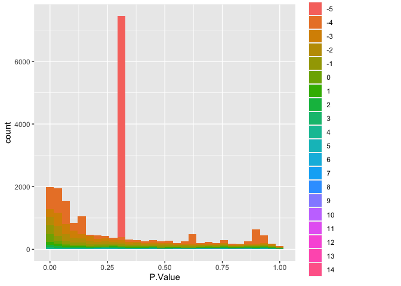<!-- -->

There are a lot of not significant genes with low expression, that might
be houshold genes but have nothing to do with the treatment of the
cells. We dont trust them.

## Number of hits

### Exercise 2.6

Genes tested:

``` r
limmaRes |> 
    rownames_to_column("Genes") |> 
    count(unique("Genes"))
```

    ##   unique("Genes")     n
    ## 1           Genes 22055

Significant genes:

``` r
limmaRes |> 
    rownames_to_column("Gene") |> 
    filter(adj.P.Val < 0.01 & AveExpr > -4 ) |>  
    count()
```

    ##    n
    ## 1 88

``` r
limmaResSig <- limmaRes |> 
    rownames_to_column("Gene") |> 
    filter(adj.P.Val < 0.01 & AveExpr > -4 ) # i am very strict on what is significant
```

## Visualizing one gene

### Exercise 2.7

Get the Gene that is the most upregulated and downregulated

``` r
upregGenname <- limmaResSig |> 
    filter(logFC == max(logFC)) |> 
    pull(Gene)

downregGenname <- limmaResSig |> 
    filter(logFC == min(logFC)) |> 
    pull(Gene)
```

Adding the Gene to the design table and visualizing

``` r
sub.design <- sub.design |> 
    mutate( upregGen = norm.data[upregGenname,], downregGen = norm.data[downregGenname,])

ggplot(sub.design, aes(x=stimulus, y=upregGen)) +
    geom_point() +
    ylab("E") +
    ggtitle("Upregulatetd", upregGenname)
```

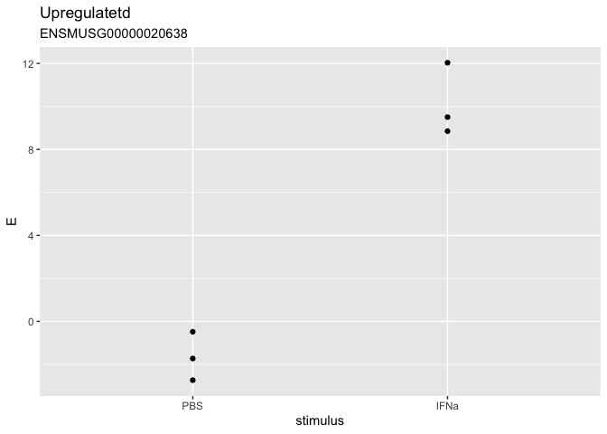<!-- -->

The `logFC` seems plausible as the gene in `IFNa` is higher expressed
than in the control `PBS`

``` r
ggplot(sub.design, aes(x=stimulus, y=downregGen)) +
    geom_point() +
    ylab("E") +
    ggtitle("Downregulated", downregGenname)
```

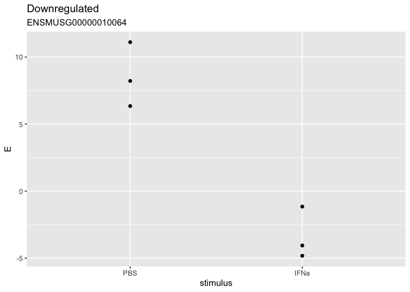<!-- -->

## Visualizing multiple genes

### Exercise 2.8

Getting top 30 absolute differently expressed genes

``` r
goi <- limmaResSig |> 
    slice_max(abs(logFC), n=30) |> 
    pull(Gene)
 

scale(norm.data[goi,]) |> 
     Heatmap(row_split=ifelse(limmaRes[goi,]$logFC > 0, "up", "down"), column_split=sub.design$stimulus)
```

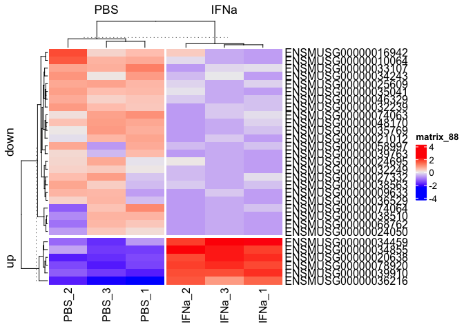<!-- -->

## Enrichment analysis

``` r
goi <- limmaResSig |> 
    filter(logFC > 0) |> 
    pull(Gene)
```

Mapping the gene names

``` r
goi <- gmap[goi,]$external_gene_name |>  unique()

databases <-  c("MSigDB_Hallmark_2020", "GO_Biological_Process_2021")

enr.res <- enrichr(goi, databases)
```

    ## Uploading data to Enrichr... Done.
    ##   Querying MSigDB_Hallmark_2020... Done.
    ##   Querying GO_Biological_Process_2021... Done.
    ## Parsing results... Done.

Hallmark

``` r
enr.res$MSigDB_Hallmark_2020 |> 
    ggplot( aes(x=log(Odds.Ratio), y=fct_reorder(Term, Odds.Ratio), size = -log10(P.value))) +
    geom_point() 
```

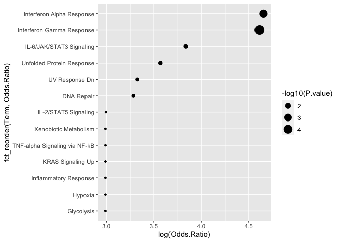<!-- -->

Bioprocess

``` r
enr.res$GO_Biological_Process_2021 |> 
    filter(P.value < 0.01) |> 
    ggplot( aes(x=log(Odds.Ratio), y=fct_reorder(Term, Odds.Ratio), size = -log10(P.value))) +
    geom_point() 
```

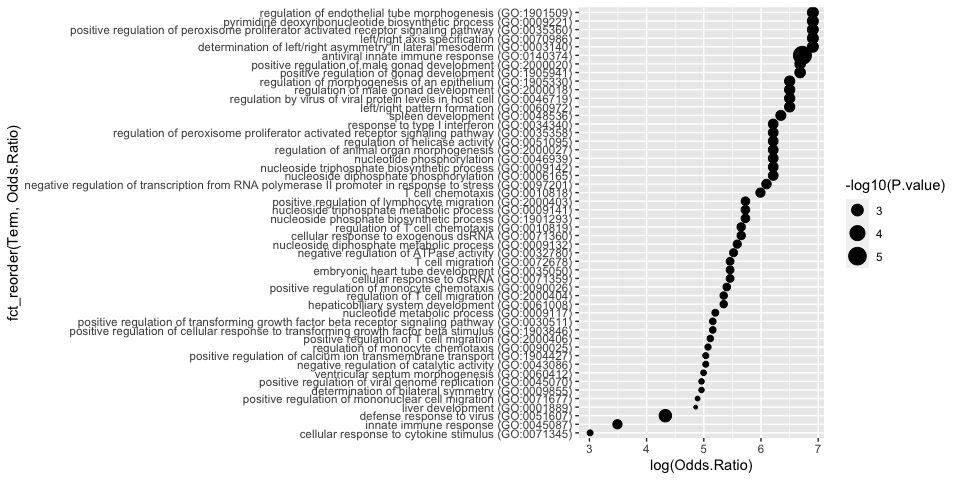<!-- -->

## Final questions

### Exercise 2.10

Some genes in PBS_2 are low expressed, that are also low expressed in
IFNa. Looking at the MDS also this sample appears to be different from
the other PBS samples and somewhat similar to the IFNa samples.
Moreover, IFNa_2 expression levels seem to be similar to the PBS samples
according to the MDS plot. <br> In this case filtering lowly expressed
genes might not be necessary as none of them are significant according
to the p-value distributions. However, the applied cut off filter them
anyways. <br> I would trust the results more would I have a little bit
more insight in the applied functions. <br> The results of the
enrichment analysis suggests an increase in INFa response and immune
response, which likely is true, because the cells were treated with
IFNa.
