Day 2 Hands-on-Biomedical-Data
================
Daniel Katzlberger
2023-11-27

# A more complex example

Load packages

``` r
require(tidyverse)
require(limma)
require(patchwork)
require(pheatmap)
require(ComplexHeatmap)
require(enrichR)
```

Load data

``` r
data <- readRDS("data.RDS")
design <- readRDS("design.RDS")
gmap <- readRDS("gmap.RDS")
```

## Subsetting the data

Only working with liver_fibroblasts (Gp38 positive)

``` r
sub.design <- design[grepl("Liver_Fibroblasts", row.names(design)),] |> 
    filter(cell_type == "GP38posCD31neg")

sub.data <- data[,row.names(sub.design)] # only expression data for the liver_fibroblasts
stopifnot(colnames(sub.data) == row.names(sub.design)) # checking if columns and rows align
```

### Exercise 3.1

How many samples are in `sub.design`

``` r
dim(sub.design) 
```

    ## [1] 20  3

20 observations in `sub.design`

## Correlation analysis

``` r
colnames(sub.data) <- gsub("^Liver_Fibroblasts_(.+)_RNA_(\\d)$", "\\1_\\2", colnames(sub.data)) # rename column names
corMT <- cor(sub.data, method="spearman")
diag(corMT) <- NA
Heatmap(corMT)
```

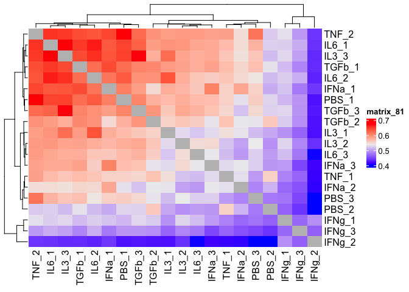<!-- -->

### Exercise 3.2

There are six unique stimuli (excluding PBS)

``` r
unique(sub.design$stimulus)
```

    ## [1] "IL6"  "TGFb" "TNF"  "IFNa" "PBS"  "IL3"  "IFNg"

IFNg stimulus expression seem to correlate least with other stimuli and
forms its own cluster. High correlation appears with the TNF, IL6, IL3.
I would have thought that each stimulus would form clusters. However,
that is not true. <br>

## MDS projection

``` r
data.frame(cmdscale(dist(2-corMT),eig=TRUE, k=2)$points) |> 
    add_column(stimulus = sub.design$stimulus) |> 
    rownames_to_column("sample") |> 
    mutate(sn = str_replace(sample, "^.+?_(\\d)$", "\\1")) |> # This shortens the sample names to just the number at the end
    ggplot(aes(x=X1,y=X2)) + 
    geom_point(aes(color=stimulus)) +
    geom_text(aes(label=sn), hjust = 1.5) +
    theme_bw()
```

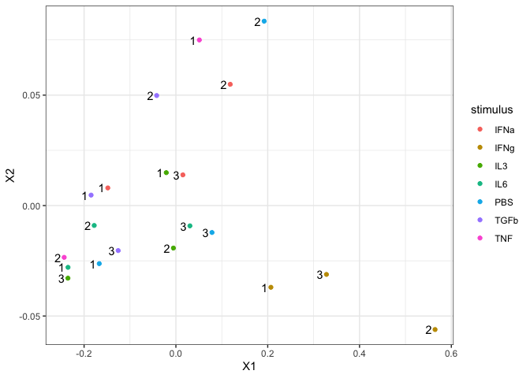<!-- -->

In the MDS projection the IFNg stimulus also separates from the rest of
the samples

## Differential expression and data normalization

### Setup up the model matrix

``` r
row.names(sub.design) <- gsub("^Liver_Fibroblasts_(.+)_RNA_(\\d)$", "\\1_\\2", row.names(sub.design)) # rename row.names of sub.design
sub.design <- sub.design |> 
    mutate(stimulus = factor(stimulus, ordered = FALSE)) |> 
    mutate(stimulus = relevel(stimulus, "PBS")) # relevel to make PBS control
model <- model.matrix(~stimulus, data=sub.design)
Heatmap(model)
```

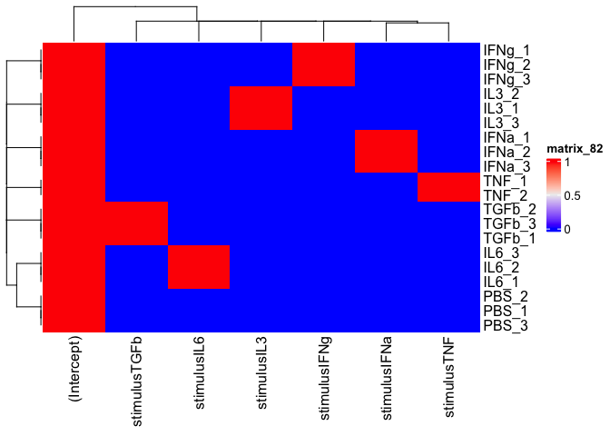<!-- -->

### Normalize data

``` r
dataVoom <- voom(sub.data, design=model, plot = TRUE)
```

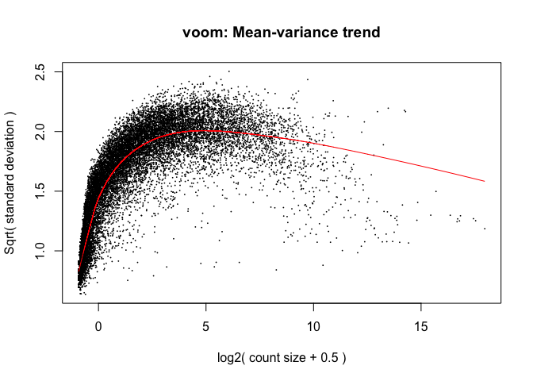<!-- -->

### Perform differential expression

``` r
limmaFit <- lmFit(dataVoom, design=model)
limmaFit <- eBayes(limmaFit)
```

Look at coefs and store them in a list

``` r
limmaRes <- list() 
for(coefx in colnames(coef(limmaFit))){
    limmaRes[[coefx]] <- topTable(limmaFit, coef=coefx,number = Inf) |> 
        rownames_to_column("ensg")
}
limmaRes <- bind_rows(limmaRes, .id = "coef") 
limmaRes <- filter(limmaRes, coef != "(Intercept)") 
```

## Data interpretation

### Vulcano plot

### Exercise 3.3

``` r
threshold <- abs(limmaRes$logFC) > 2 & limmaRes$P.Value < 0.05 # set threshold
ggplot(limmaRes, aes(x = logFC, y= -log10(P.Value), color = threshold)) +
    geom_point(alpha = 0.2) +
    scale_color_brewer(palette = "Set2") +
    theme(legend.position = "none") +
    geom_hline(yintercept = -log10(0.05)) + 
    geom_vline(xintercept = c(-2, 2)) +
    facet_wrap(coef~.)
```

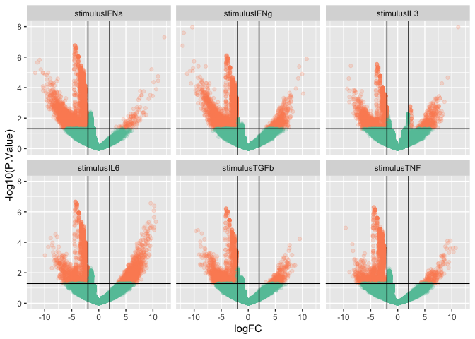<!-- -->

### P-value distribution

### Exercise 3.4

``` r
ggplot(limmaRes, aes(x=P.Value, fill=factor(floor(AveExpr)))) + 
    geom_histogram() +
    facet_wrap(coef~.)
```

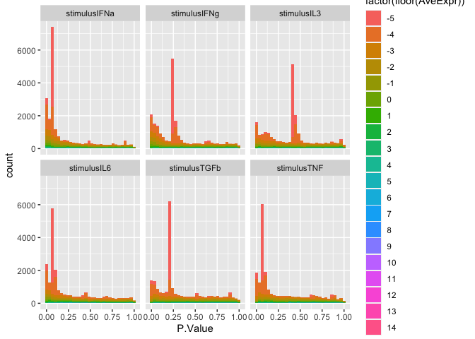<!-- -->

### Number of hits

### Exercise 3.5

``` r
limmaRes |> dplyr::count(coef)
```

    ##           coef     n
    ## 1 stimulusIFNa 22055
    ## 2 stimulusIFNg 22055
    ## 3  stimulusIL3 22055
    ## 4  stimulusIL6 22055
    ## 5 stimulusTGFb 22055
    ## 6  stimulusTNF 22055

Per stimulus 22055 genes are tested, this equals to

``` r
dim(limmaRes)
```

    ## [1] 132330      8

132330 tests performed However the significant genes are way less for
each stimulus.

``` r
limmaRes |> 
    filter(adj.P.Val < 0.01 & AveExpr > -4 ) |> # we cut off the lowly expressed genes as the p.value distribution is bad
    count(coef)
```

    ##           coef   n
    ## 1 stimulusIFNa 776
    ## 2 stimulusIFNg 322
    ## 3  stimulusIL3  52
    ## 4  stimulusIL6 587
    ## 5 stimulusTGFb 198
    ## 6  stimulusTNF 392

``` r
limmaResSig <- limmaRes |> 
    filter(adj.P.Val < 0.01 & AveExpr > -4 )
```

## Visualizing results

### Visualizing one gene

### Exercise 3.6

``` r
upregGenename <- limmaResSig |> 
    filter(logFC == max(logFC)) |> # getting gene with highest logFC
    pull(ensg)

norm.data <- dataVoom$E # getting norm. expression data 

sub.design |> 
    mutate(upregGene = norm.data[upregGenename,]) |> 
    ggplot(aes(x=stimulus, y=upregGene)) +
    geom_point() +
    ggtitle(upregGenename) +
    ylab("E")
```

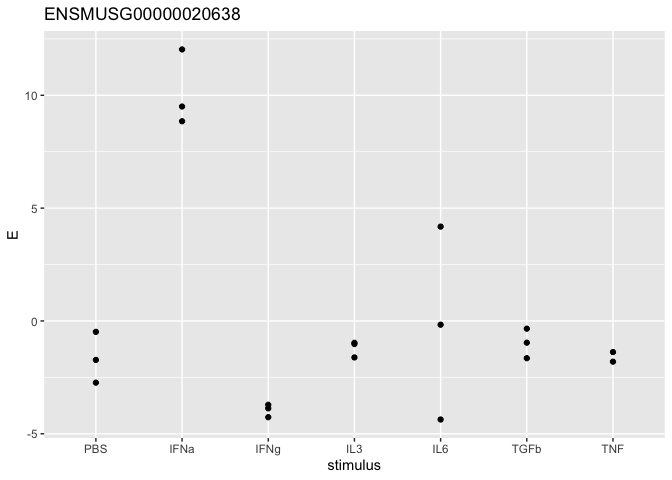<!-- -->

``` r
limmaRes |> 
    filter(ensg == upregGenename) |> 
    pull(coef, logFC)
```

    ##  12.1096357843859 -1.86928348043579 0.756852812612787  1.97510990211787  1.01116412509331 
    ##    "stimulusIFNa"    "stimulusIFNg"     "stimulusIL3"     "stimulusIL6"    "stimulusTGFb" 
    ## 0.410585884591459 
    ##     "stimulusTNF"

For each stimuli the plot (expression data) and according logFC looks
true (match). The expression change of the gene was significant for the
IFNa stimulus all other stimuli did not change the expression
significantly. <br> I figured out this was the same gene as from
yesterdays course. I want to look at a gene, that expression has
significantly changed but because of another stimuli than IFNa.

``` r
downregGenename <- limmaResSig |> 
    filter(coef == "stimulusIL3") |> 
    filter(logFC == min(logFC)) |>  # getting gene with lowest logFC and stimulus IL3
    pull(ensg)

sub.design |> 
    mutate(downregGene = norm.data[downregGenename,]) |> 
    ggplot(aes(x=stimulus, y=downregGene)) +
    geom_point() +
    ggtitle(downregGenename) +
    ylab("E")
```

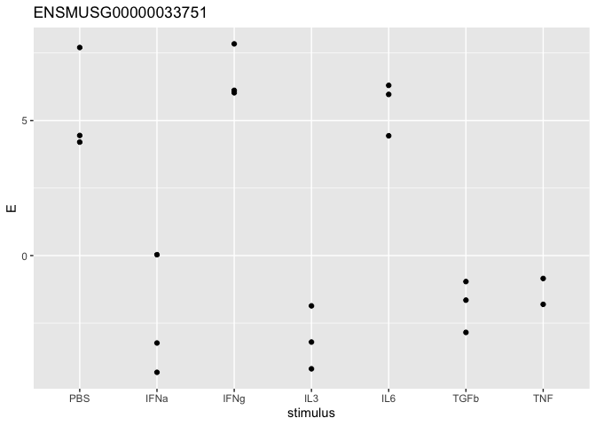<!-- -->

The expression in control (PBS) for this gene is quiet high. Moreover,
this gene has low expression levels also for the stimuli IFNa, TGFb,
TNF. Lets have a look if they are also significant.

``` r
limmaResSig |> 
    filter(ensg == downregGenename) |> 
    pull(coef, adj.P.Val) # getting stimulus and adj.P.value 
```

    ## 0.00546462588672219 0.00663720833729965 
    ##      "stimulusIFNa"       "stimulusIL3"

The change only is significant for the stimulus IFNa, IL3

### Visualizing multiple genes

Get the top 5 significant genes by logFC for each stimulus <br> First
plot statistics

``` r
goi.all <- limmaResSig |> 
    group_by(coef) |> 
    slice_max(abs(logFC), n=5) |> # again use the absolute logFC 
    pull(ensg)
    
(p.coef <- limmaRes |> 
    filter(ensg %in% goi.all) |> 
    mutate(gene = gmap[ensg,]$external_gene_name)|> 
    filter(gene != is.na(gene)) |> # filtering genes for which is no genename to map
    ggplot(aes(y=gene, x=str_remove(coef, "stimulus"), color=logFC, size=-log10(adj.P.Val))) + 
    geom_point() +
    scale_color_gradient2(high="red", low="blue") +
    xlab("stimulus") +
    theme_bw())
```

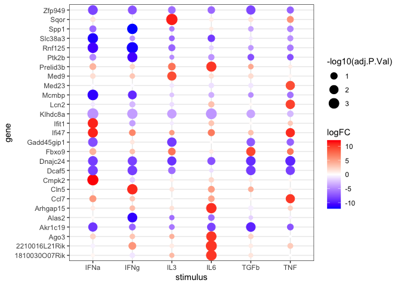<!-- -->

Now plot expression data

``` r
dat.list <- list()
for(gg in goi.all){
    dat.list[[gg]] <- sub.design |> 
        mutate(E=scale(dataVoom$E[gg,])) |> 
        rownames_to_column("sample") |> 
        remove_rownames()
}

(p.vals <- bind_rows(dat.list, .id="ensg") |> 
        mutate(gene = gmap[ensg,]$external_gene_name) |> 
        filter(gene != is.na(gene)) |> # filtering genes for which is no genename to map
        mutate(stimulus = as.character(stimulus)) |> 
        ggplot(aes(x=sample, y=gene, fill=E)) + 
        geom_tile() +
        facet_grid(. ~ stimulus, space ="free", scales = "free") +
        scale_fill_gradient2(low="blue", high="red"))
```

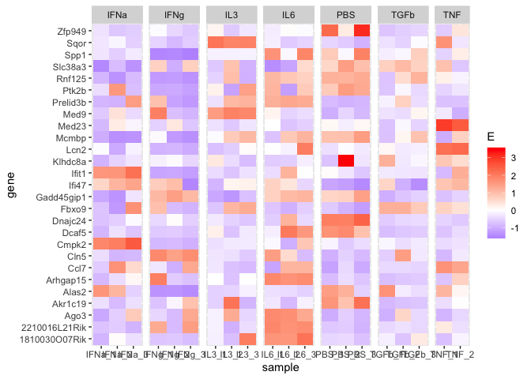<!-- -->

Final plot.

``` r
p.vals + p.coef
```

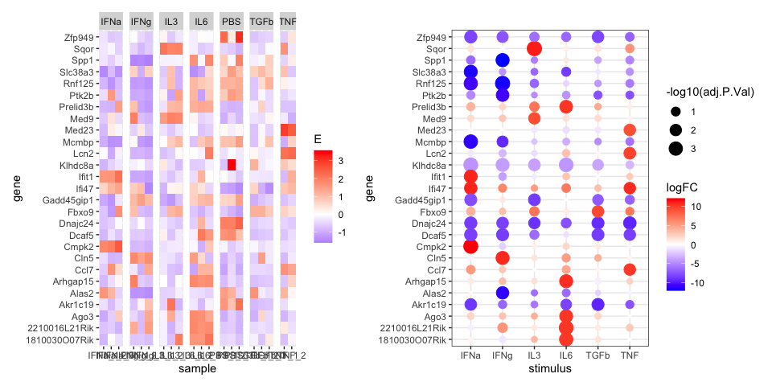<!-- -->

## Enrichment analysis

``` r
databases <-  c("MSigDB_Hallmark_2020", "GO_Biological_Process_2021") # defining databases to enrich in

enr.res.list <- list()
for(coefx in unique(limmaResSig$coef)){
    
    # Extract genes of interests (GOI) for a given coefficient (see yesterday's example)
    goi.E <-  limmaResSig |> 
        filter(coef == coefx & logFC > 0) |> 
        pull(ensg)
    
    goi.E <- gmap[goi.E,]$external_gene_name |>  unique()
    
    # Add code here to perform enrichment analysis (see yesterday's example)
    enr.res <- enrichr(goi.E, databases)
    
    # The results will be a list, where each entry is one database. We will combine those into one long table
    enr.res <- bind_rows(enr.res, .id="db")
    
    # Store results in the list
    enr.res.list[[coefx]] <- enr.res
}
```

    ## Uploading data to Enrichr... Done.
    ##   Querying MSigDB_Hallmark_2020... Done.
    ##   Querying GO_Biological_Process_2021... Done.
    ## Parsing results... Done.
    ## Uploading data to Enrichr... Done.
    ##   Querying MSigDB_Hallmark_2020... Done.
    ##   Querying GO_Biological_Process_2021... Done.
    ## Parsing results... Done.
    ## Uploading data to Enrichr... Done.
    ##   Querying MSigDB_Hallmark_2020... Done.
    ##   Querying GO_Biological_Process_2021... Done.
    ## Parsing results... Done.
    ## Uploading data to Enrichr... Done.
    ##   Querying MSigDB_Hallmark_2020... Done.
    ##   Querying GO_Biological_Process_2021... Done.
    ## Parsing results... Done.
    ## Uploading data to Enrichr... Done.
    ##   Querying MSigDB_Hallmark_2020... Done.
    ##   Querying GO_Biological_Process_2021... Done.
    ## Parsing results... Done.
    ## Uploading data to Enrichr... Done.
    ##   Querying MSigDB_Hallmark_2020... Done.
    ##   Querying GO_Biological_Process_2021... Done.
    ## Parsing results... Done.

``` r
enr.res.all <- bind_rows(enr.res.list, .id="coef")
```

### Plotting the results of the enrichment

``` r
filterTerm <- enr.res.all |> 
    filter(Adjusted.P.value < 0.01 & Odds.Ratio > 6) |> 
    pull(Term)
```

``` r
enr.res.all |> 
    filter(Term %in% filterTerm) |> 
    ggplot(aes(x=gsub("stimulus","",coef), y=Term, size = -log10(Adjusted.P.value), color = log(Odds.Ratio))) +
    geom_point() +
    scale_colour_gradient2(low='blue', mid = "white", high='red') 
```

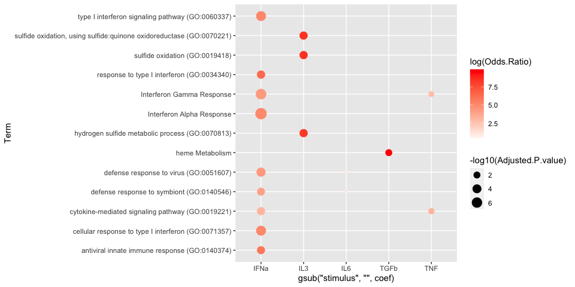<!-- -->

This plot might differ because my cut off for significant genes was 0.01

### Plot genes related to the enrichments

``` r
goi.enr <- enr.res.all |> 
    filter(Adjusted.P.value < 0.01 & Odds.Ratio > 6) |> 
    pull("Genes") |> 
    str_split(";") |> 
    unlist() |> 
    unique()

limmaRes |> 
    mutate(gene = gmap[ensg,]$external_gene_name) |> 
    filter(toupper(gene) %in% goi.enr) |> 
    ggplot(aes(x = gsub("stimulus","",coef), y = gene, size = -log10(adj.P.Val), color = logFC)) +
    geom_point() +
    scale_colour_gradient2(low='blue', mid = "white", high='red') +
    ylab("Stimulus") 
```

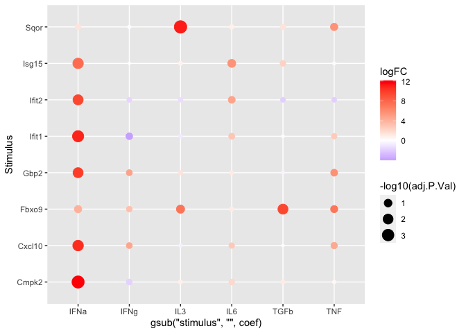<!-- -->

## Final questions

### Exercise 3.10

The MDS suggests, that the IFNg stimulus is different and forms its own
cluster. The correlation within this samples is also not high but the
distance on the dendogram is the shortest. There is a cluster including
IL3, IL6, TNF and TGFb. Lowly expressed genes are filter as they are
also significant this time. The most significant genes has the IFNa
stimulus, closely followed by IL6 and TNF. The highest change in
positive (increasing) expression is hard to tell as the logFC was
filtered by absolute values.The plots show the highest change in
decreasing and increasing expression. However, the plots suggest more
down regulation of genes for each stimulus. This time i am more
confident in my analysis. However, one thing I really would expect is
that the stimuli would form clusters. <br> The enrichment analysis shows
again a lot of data for the IFNa stimulus and this data makes sense.
<br>

## Doing enrichment for downregulated genes

This failed as no enrichment was significant
