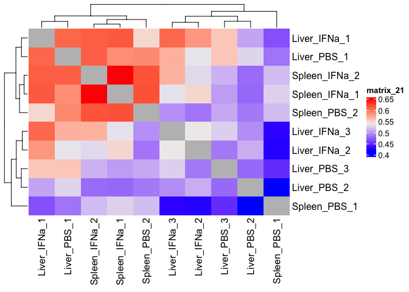
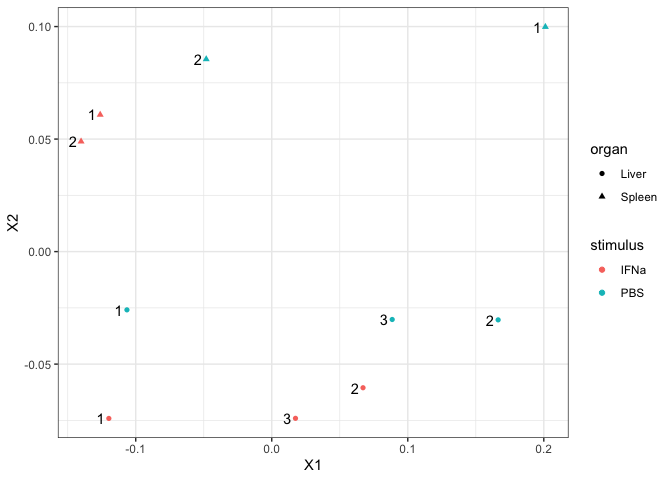
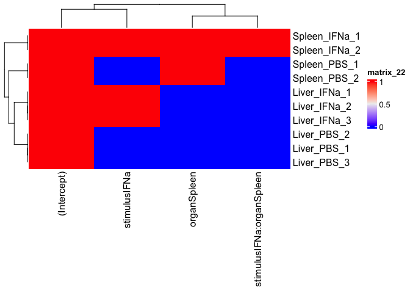
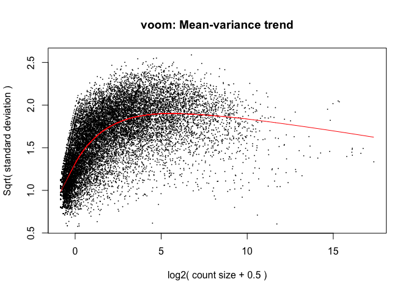
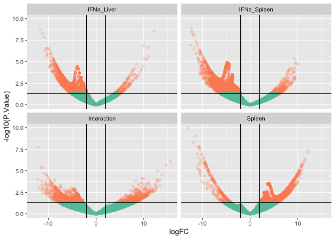
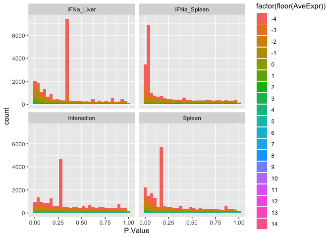
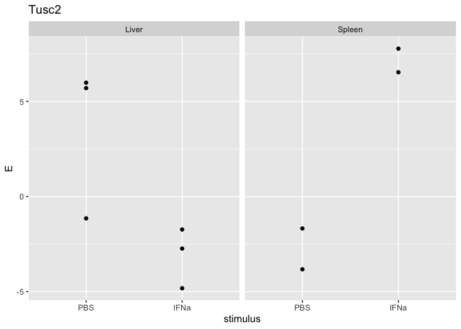
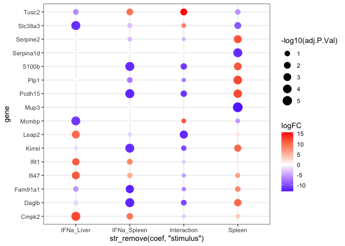
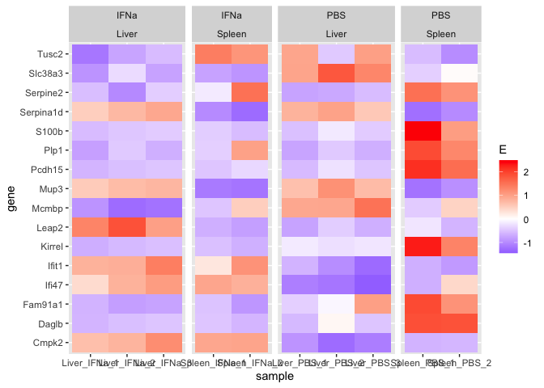
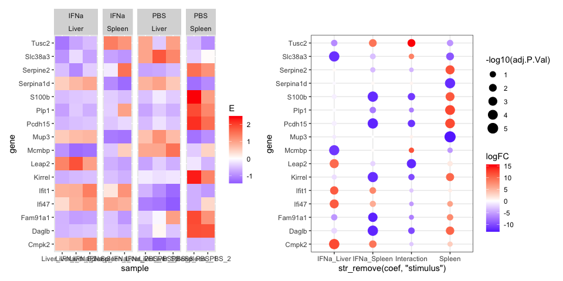

Day 2 Hands-on-Biomedical-Data
================
Daniel Katzlberger
2023-12-04

# A more complex example

Load packages

``` r
require(tidyverse)
require(limma)
require(patchwork)
require(pheatmap)
require(ComplexHeatmap)
require(enrichR)
```

Load data

``` r
data <- readRDS("data.RDS")
design <- readRDS("design.RDS")
gmap <- readRDS("gmap.RDS")
```

## Subsetting the data

Working with liver_fibroblasts and spleen_fibroblasts (Gp38 positive)

``` r
sub.design1 <- design[grepl("Liver_Fibroblasts", row.names(design)),] |> 
    filter(cell_type == "GP38posCD31neg" & stimulus %in% c("PBS", "IFNa"))

sub.design2 <- design[grepl("Spleen_Fibroblasts", row.names(design)),] |> 
    filter(cell_type == "GP38posCD31neg" & stimulus %in% c("PBS", "IFNa"))

sub.design <- rbind(sub.design1, sub.design2)

sub.data <- data[,row.names(sub.design)] 
stopifnot(colnames(sub.data) == row.names(sub.design)) # checking if columns and rows align
```

### Exercise 4.1

How many samples are in `sub.design`

``` r
dim(sub.design) 
```

    ## [1] 10  3

10 observations in `sub.design`

# Correlation analysis

## Correlation Heatmap

``` r
colnames(sub.data) <- gsub("^(.+)_Fibroblasts_(.+)_RNA_(\\d)$", "\\1_\\2_\\3", colnames(sub.data)) # rename column names
corMT <- cor(sub.data, method="spearman")
diag(corMT) <- NA
Heatmap(corMT)
```

<!-- -->

## MDS projection

``` r
data.frame(cmdscale(dist(2-corMT),eig=TRUE, k=2)$points) |> 
    add_column(stimulus = sub.design$stimulus) |> 
    add_column(organ = sub.design$organ) |> 
    rownames_to_column("sample") |> 
    mutate(sn = str_replace(sample, "^.+?_(\\d)$", "\\1")) |> 
    ggplot(aes(x=X1,y=X2, shape = organ)) + 
    geom_point(aes(color=stimulus)) +
    geom_text(aes(label=sn), hjust = 1.5) +
    theme_bw()
```

<!-- -->

### Exercise 4.1

The MDS projection differs the organs. However, the heatmap also shows
high correlation between organs. The Liver_PBS_1 sample is hard to
interpret as it shows high correlation within the organ and its stimuli
but also between organs.

# Differential expression and data normalization

## Setup up the model matrix

``` r
row.names(sub.design) <- gsub("^(.+)_Fibroblasts_(.+)_RNA_(\\d)$", "\\1_\\2_\\3", row.names(sub.design)) # rename row names names
sub.design <- sub.design |> 
    mutate(stimulus = factor(stimulus, ordered = FALSE)) |> 
    mutate(stimulus = relevel(stimulus, "PBS")) # relevel to make PBS control


model <- model.matrix(~stimulus*organ, data=sub.design)
Heatmap(model)
```

<!-- -->

## Normalize data

``` r
dataVoom <- voom(sub.data, design=model, plot = TRUE)
```

<!-- -->

## Perform differential expression

``` r
limmaFit <- lmFit(dataVoom, design=model)
limmaFit <- eBayes(limmaFit)
```

Store coefs in a list

``` r
limmaRes <- list() 
for(coefx in colnames(coef(limmaFit))){
    limmaRes[[coefx]] <- topTable(limmaFit, coef=coefx,number = Inf) |> 
        rownames_to_column("ensg")
}
limmaRes <- bind_rows(limmaRes, .id = "coef") 
limmaRes <- filter(limmaRes, coef != "(Intercept)") 
```

## Fit contrast

The effect of IFNa (control PBS) in spleen

``` r
colnames(coef(limmaFit))
```

    ## [1] "(Intercept)"              "stimulusIFNa"             "organSpleen"             
    ## [4] "stimulusIFNa:organSpleen"

``` r
# check if all important coefs are present
stopifnot(all(colnames(coef(limmaFit)) == c("(Intercept)", "stimulusIFNa", "organSpleen", "stimulusIFNa:organSpleen"))) 

# creating contrats matrix
contrast.mt <- cbind(IFNa_Spleen = c(0,1,0,1))
row.names(contrast.mt) <- colnames(coef(limmaFit))

# fitting contrast
limmaFit.contrast <- contrasts.fit(limmaFit,contrast.mt)
limmaFit.contrast <- eBayes(limmaFit.contrast)

# extracting results
limmaRes.contrast <- topTable(limmaFit.contrast, coef=colnames(contrast.mt),number = Inf) |> 
    rownames_to_column("ensg") |> 
    mutate(coef=colnames(contrast.mt))

# add to rest of table
limmaRes <- rbind(limmaRes.contrast, limmaRes)
table(limmaRes$coef)
```

    ## 
    ##              IFNa_Spleen              organSpleen             stimulusIFNa stimulusIFNa:organSpleen 
    ##                    22055                    22055                    22055                    22055

Cleaning up

``` r
limmaRes$gene <- gmap[limmaRes$ensg,]$external_gene_name # here we add the gene symbol

limmaRes <- limmaRes %>%
    mutate(coef = str_replace(coef, "organ", "")) |> 
    mutate(coef = str_replace(coef, "stimulus", "")) |> 
    mutate(coef = str_replace(coef, "^IFNa$", "IFNa_Liver")) |> 
    mutate(coef = str_replace(coef, "^IFNa\\:Spleen$", "Interaction")) 
```

# Data interpretation

## Vulcano plot

### Exercise 4.3

``` r
threshold <- abs(limmaRes$logFC) > 2 & limmaRes$P.Value < 0.05 # set threshold
ggplot(limmaRes, aes(x = logFC, y= -log10(P.Value), color = threshold)) +
    geom_point(alpha = 0.2) +
    scale_color_brewer(palette = "Set2") +
    theme(legend.position = "none") +
    geom_hline(yintercept = -log10(0.05)) + 
    geom_vline(xintercept = c(-2, 2)) +
    facet_wrap(coef~.)
```

<!-- -->

## P-value distribution

### Exercise 4.4

``` r
ggplot(limmaRes, aes(x=P.Value, fill=factor(floor(AveExpr)))) + 
    geom_histogram() +
    facet_wrap(coef~.)
```

    ## `stat_bin()` using `bins = 30`. Pick better value with `binwidth`.

<!-- -->

Again there are very low expressed genes of which the p.value
distribution looks off

## Number of hits

### Exercise 4.5

``` r
limmaRes |> dplyr::count(coef)
```

    ##          coef     n
    ## 1  IFNa_Liver 22055
    ## 2 IFNa_Spleen 22055
    ## 3 Interaction 22055
    ## 4      Spleen 22055

per coef 22055 genes are tested Significant genes are less

``` r
limmaRes |> 
    filter(adj.P.Val < 0.01 & AveExpr > -4 ) |> # we cut off the lowly expressed genes as the p.value distribution is bad
    count(coef)
```

    ##          coef   n
    ## 1  IFNa_Liver  35
    ## 2 IFNa_Spleen 329
    ## 3 Interaction   2
    ## 4      Spleen 112

``` r
limmaResSig <- limmaRes |> 
    filter(adj.P.Val < 0.01 & AveExpr > -4 )
```

# Visualizing results

## Visualizing one gene

### Exercise 4.6

``` r
interactionGenename <- limmaResSig |> 
    filter(coef == "Interaction" & logFC == max(abs(logFC))) |> 
    pull("ensg") # getting biggest logFC for interaction coef

norm.data <- dataVoom$E # getting norm. expression data 

sub.design |> 
    mutate(interactionGene = norm.data[interactionGenename, ]) |> 
    ggplot(aes(x=stimulus, y=interactionGene)) +
    geom_point() +
    facet_wrap(organ~.) +
    ggtitle(gmap[interactionGenename,]$external_gene_name) +
    ylab("E")
```

<!-- -->

``` r
limmaRes |> 
    filter(ensg == interactionGenename) |> 
    pull(logFC, coef)
```

    ## IFNa_Spleen  IFNa_Liver      Spleen Interaction 
    ##    9.301681   -6.308623   -5.698489   15.610304

The logFC for the coefs IFNa_spleen, IFNa_liver and the interaction are
understandable. The organ effet is a bit tricky.

## Visualizing multiple genes

### Exercise 4.7

``` r
goi.all <- limmaResSig |> 
    group_by(coef) |> 
    slice_max(abs(logFC), n=5) |> # again use the absolute logFC 
    pull(ensg)

(p.coef <- limmaRes |> 
        filter(ensg %in% goi.all) |> 
        mutate(gene = gmap[ensg,]$external_gene_name) |> 
        ggplot(aes(y=gene, x=str_remove(coef, "stimulus"), color=logFC, size=-log10(adj.P.Val))) + 
        geom_point() +
        scale_color_gradient2(high="red", low="blue") +
        theme_bw())
```

<!-- -->

Plot expression data

``` r
dat.list <- list()
for(gg in goi.all){
    dat.list[[gg]] <- sub.design |> 
        mutate(E=scale(norm.data[gg,])) |> 
        rownames_to_column("sample") |> 
        remove_rownames()
}

(p.vals <- bind_rows(dat.list, .id="ensg") |> 
        mutate(gene = gmap[ensg,]$external_gene_name) |> 
        mutate(stimulus = as.character(stimulus)) |> 
        ggplot(aes(x=sample, y=gene, fill=E)) + 
        geom_tile() +
        facet_grid(. ~ stimulus + organ, space ="free", scales = "free") +
        scale_fill_gradient2(low="blue", high="red"))
```

<!-- -->

Final plot.

``` r
p.vals + p.coef
```

<!-- -->

## Final questions

### Exercise 4.8

The correlation heatmap with a lot of data is getting confusing. MDS
projection does help a lot in cases like this, because you can see
clearly separated groups very easy. I think at this point something like
a cluster map, where samples are arranged according to the distance are
visualized + its correlation. <br> In this case it also makes sense to
filter lowly expressed genes as there are significant ones. <br> I can
fully trust it once I did it on my own dataset <br> Hard to tell were
effects are stronger. The downreulation of genes is stronger in Spleen.
Upregulation is stronger in Liver. On average it is hard to tell. More
significant genes are found in Spleen.
