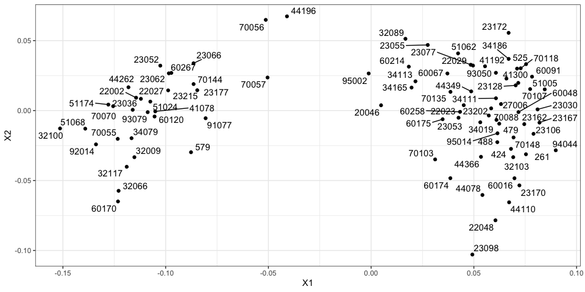

Day 2 Hands-on-Biomedical-Data
================
Daniel Katzlberger
2023-12-04

# My own Dataset

Load packages

``` r
require(tidyverse)
require(limma)
require(patchwork)
require(pheatmap)
require(ComplexHeatmap)
require(enrichR)
require(ggrepel)
require(gemma.R)
```

# Getting Data

``` r
gse <- "GSE12172"

get_datasets(gse) |> 
    select(taxon.Name, experiment.Accession, experiment.SampleCount, experiment.Description)
```

    ##    taxon.Name experiment.Accession experiment.SampleCount
    ## 1:      human             GSE12172                     90
    ##                                                                                                                                                                                                                                                                                                                                                                                                                                                                                                                    experiment.Description
    ## 1: Expression profile of 30 LMP tumours and 60 Serous tumours were compared to identify the biolgical pathways specific to these groups. Genotyping was done to identify the mutations potentially causing these phenotypes\nLast Updated (by provider): Apr 12 2012\nContributors:  Joshy George Richard Tothill Raghawa Sharma Nic Wadell Nadia Traficante Peter Russell David D Bowtell Georgia Chenevix-Trench Michael S Anglesio Michael J Birrer Sian Fereday Bianca Locandro Anna V Tinker Anna deFazio Jeremy M Arnold Lisa Simms

``` r
design <- get_dataset_design(gse) # get design table
e <- get_dataset_processed_expression(gse) # get expression
e <- as.data.frame(e) # make it to data frame

data <- as.matrix(e[,row.names(design)]) 
row.names(data) <- e$GeneSymbol # make it expression data
data <- as.data.frame(data)

dim(design)
```

    ## [1] 90  5

``` r
dim(data)
```

    ## [1] 54675    90

Data contains all 90 samples

## Further inside in the data

``` r
design |> 
    count(disease.staging)
```

    ##   disease.staging  n
    ## 1         stage_I 16
    ## 2        stage_II  7
    ## 3       stage_III 57
    ## 4        stage_IV 10

``` r
design |> 
    count(phenotype)
```

    ##                 phenotype  n
    ## 1 low_malignant_potential 30
    ## 2               malignant 60

Most samples are from disease stage III with 57 samples. There are only
7 samples from disease stage II. The phenotype contains the information
from which tumor the sample origins.The description of the data says
that 30 samples are derived from LMP tumors and 60 from Serous tumors
found in the variable `phenotypes`. <br> For the first part the
differential expression between disease stages is analysed.

``` r
# new.names.df <- design |> 
#    rownames_to_column("sample") |> 
#    unite(new_name, sample, disease.staging) |> 
#    select(new_name)

# colnames(data) <- new.names.df$new_name
```

## Filter samples with `<NA>` and removing it from design table

``` r
NA.column <- names(which(sapply(data, function(x)all(is.na(x))))) # sample that is removed

data <- data |> select(where(function(x) all(!is.na(x)))) # removing sample from data
design <- design[rownames(design) %in% colnames(data),] # removing sample from design table

stopifnot(colnames(data) == row.names(design)) # checking if columns and rows align
```

# Correlation Analysis

## Correlation heatmap

``` r
corMT <- cor(data, method="spearman") 
diag(corMT) <- NA
```

``` r
Heatmap(corMT)
```

<!-- -->

## MDS projection

``` r
data.frame(cmdscale(dist(2-corMT),eig=TRUE, k=2)$points) |> 
    rownames_to_column("sample") |> 
    mutate(sample = str_replace_all(sample, "^[^_]*_","")) |> 
    ggplot(aes(x=X1,y=X2)) + 
    geom_point() +
    geom_text_repel(aes(label=sample)) +
    theme_bw()
```

    ## Warning: ggrepel: 3 unlabeled data points (too many overlaps). Consider increasing max.overlaps

<!-- -->

The heatmap and the MDS projection suggest that there might be two
clusters in our data. Try to figure out what the clusters might be.

## Clustering

``` r
tree <- hclust(dist(t(data)))
```

``` r
plot(tree)
```

<!-- -->

``` r
cutree <- as.data.frame(cutree(tree, k = 2)) |> 
    mutate(hcluster = cutree(tree, k = 2)) |> 
    select(hcluster)

cutree |> 
    count(hcluster)
```

    ##   hcluster  n
    ## 1        1 57
    ## 2        2 32

It seems the clustering differentiates the two phenotypes. However, it
is not able to distinguish all samples correctly.

# Differential expression and data normalization

## Model matrix

Disease stage I is used as intercept

``` r
design <- design |> 
    mutate(disease.staging = factor(disease.staging, ordered = FALSE)) |> 
    mutate(disease.staging = relevel(disease.staging, "stage_I")) # relevel to make stage I control


model <- model.matrix(~disease.staging, data=design)
```

``` r
Heatmap(model)
```

<!-- -->

## Distribution of data

Looking at distribution to decide if normalization is needed.

``` r
boxplot(data[1:30,])
```

<!-- -->

``` r
boxplot(t(data[1:30,]))
```

<!-- -->

Data seems already normalized. No normalization needed.

## Perform differential expression

``` r
limmaFit <- lmFit(data, design=model)
limmaFit <- eBayes(limmaFit)


limmaRes <- list() 
for(coefx in colnames(coef(limmaFit))){
    limmaRes[[coefx]] <- topTable(limmaFit, coef=coefx,number = Inf) |> 
        rownames_to_column("gene")
}

limmaRes <- bind_rows(limmaRes, .id = "coef") 
limmaRes <- filter(limmaRes, coef != "(Intercept)") 
```

# Data interpretation

## Vulcano plot

``` r
threshold <- abs(limmaRes$logFC) > 2 & limmaRes$P.Value < 0.05 # set threshold
```

``` r
limmaRes |> 
    mutate(coef = str_replace(coef, "disease.staging", "")) |> 
    ggplot(aes(x = logFC, y= -log10(P.Value), color = threshold)) +
    geom_point(alpha = 0.2) +
    scale_color_brewer(palette = "Set2") +
    theme(legend.position = "none") +
    geom_hline(yintercept = -log10(0.05)) + 
    geom_vline(xintercept = c(-2, 2)) +
    facet_wrap(coef~.)
```

<!-- -->

The vulcano plot reveals that there are no big difference between stage
I and stage II. However, with later disease stages the difference
increases. \## P-value distribution

``` r
ggplot(limmaRes, aes(x=P.Value, fill=factor(floor(AveExpr)))) + 
    geom_histogram() +
    facet_wrap(coef~.)
```

    ## `stat_bin()` using `bins = 30`. Pick better value with `binwidth`.

<!-- -->

The p.value distribution seems good.

## Number of hits

Genes tested per disease stage and total number of tests performed

``` r
limmaRes |> dplyr::count(coef)
```

    ##                       coef     n
    ## 1  disease.stagingstage_II 54675
    ## 2 disease.stagingstage_III 54675
    ## 3  disease.stagingstage_IV 54675

``` r
dim(limmaRes) 
```

    ## [1] 164025      8

## Filter significant genes

Because the `p.value` distribution is good no cut off is set.

``` r
limmaRes |> 
    filter(adj.P.Val < 0.01) |> # strict cut off
    count(coef)
```

    ##                       coef     n
    ## 1  disease.stagingstage_II   279
    ## 2 disease.stagingstage_III 12826
    ## 3  disease.stagingstage_IV  7818

``` r
limmaResSig <- limmaRes |> 
    filter(adj.P.Val < 0.01)
```

# Visualizing results

## Visualizing one gene

``` r
Genename <- limmaResSig |> 
    filter(logFC == max(logFC)) |> # getting gene with the  highest logFC
    pull(gene)

data <- as.matrix(data) # convert data to matrix for later functions to work properly
```

``` r
design |> 
    mutate(upregGene = data[Genename,]) |> 
    ggplot(aes(x=disease.staging, y=upregGene)) +
    geom_point() +
    ggtitle(Genename) +
    ylab("E")
```

<!-- -->

``` r
limmaRes |> 
    filter(gene == Genename) |> 
    pull(logFC, coef)
```

    ##  disease.stagingstage_II disease.stagingstage_III  disease.stagingstage_IV 
    ##                 1.400411                 1.413468                 4.214745

`logFC` are not that high for stage II and stage III

## Visualizing multiple genes

Get the top 5 significant genes by logFC for each disease stage

``` r
goi.all <- limmaResSig |> 
    group_by(coef) |> 
    slice_max(logFC, n=5) |> # looking just at the upregulated
    pull(gene)
```

``` r
(p.coef <- limmaRes |> 
        filter(gene %in% goi.all) |> 
        ggplot(aes(y=gene, x=str_remove(coef, "disease.staging"), color=logFC, size=-log10(adj.P.Val))) + 
        geom_point() +
        scale_color_gradient2(high="red", low="blue") +
        xlab("disease.staging") +
        theme_bw())
```

<!-- -->

``` r
dat.list <- list()
for(gg in goi.all){
    dat.list[[gg]] <- design |> 
        mutate(E=scale(data[gg,])) |> 
        rownames_to_column("sample") |> 
        remove_rownames()
}
```

``` r
(p.vals <- bind_rows(dat.list, .id="gene") |> 
        ggplot(aes(x=sample, y=gene, fill=E)) + 
        geom_tile() +
        facet_grid(. ~ disease.staging, space ="free", scales = "free") +
        scale_fill_gradient2(low="blue", high="red") +
        theme(axis.text.x=element_text(angle=90,hjust=1)))
```

<!-- -->

Final plot.

``` r
p.vals + p.coef
```

<!-- -->

Interesting that for some samples particular genes are extremly
upregulated in stage II. \# Enrichment analysis Getting databases

``` r
dbs <- listEnrichrDbs()
databases <-  c("MSigDB_Hallmark_2020")
```

## Upregulated genes

``` r
enr.res.list <- list()
for(coefx in unique(limmaResSig$coef)){
    
    # Extract genes of interests (GOI) for a given coefficient (see yesterday's example)
    goi.E <-  limmaResSig |> 
        filter(coef == coefx & logFC > 1) |> 
        pull(gene) |> 
        unique()
    
    
    # Add code here to perform enrichment analysis (see yesterday's example)
    enr.res <- enrichr(goi.E, databases)
    
    # The results will be a list, where each entry is one database. We will combine those into one long table
    enr.res <- bind_rows(enr.res, .id="db")
    
    # Store results in the list
    enr.res.list[[coefx]] <- enr.res
}
```

    ## Uploading data to Enrichr... Done.
    ##   Querying MSigDB_Hallmark_2020... Done.
    ## Parsing results... Done.
    ## Uploading data to Enrichr... Done.
    ##   Querying MSigDB_Hallmark_2020... Done.
    ## Parsing results... Done.
    ## Uploading data to Enrichr... Done.
    ##   Querying MSigDB_Hallmark_2020... Done.
    ## Parsing results... Done.

``` r
enr.res.all <- bind_rows(enr.res.list, .id="coef")
```

### Plotting the results of the enrichment

``` r
filterTerm <- enr.res.all |> 
    filter(Adjusted.P.value < 0.05) |> 
    pull(Term)
```

``` r
enr.res.all |> 
    filter(Term %in% filterTerm) |> 
    ggplot(aes(x=str_remove(coef, "disease.staging"), y=Term, size = -log10(Adjusted.P.value), color = log(Odds.Ratio))) +
    geom_point() +
    scale_colour_gradient2(low='blue', mid = "white", high='red') +
    xlab("disease stage")
```

<!-- -->

# Discussion

Particular genes get upregulated with disease stage. The enrichment
analysis proposed an enrichment in the G2-M Checkpoint and E2F-Targets
and others including immun activity. However, the most differences was
observed for the phenotypes, that almost cluster in the MDS projection
and the hierachical clustering.

# Comparing disease stages in different phenotypes.

Just comparing disease stage I with disease stage IV \## Subsetting the
data

``` r
sub.design <- design |> 
    filter(disease.staging %in% c("stage_I", "stage_IV")) |> 
    mutate(disease.staging = factor(disease.staging, ordered = FALSE)) |> 
    mutate(disease.staging = relevel(disease.staging, "stage_I")) |> 
    mutate(phenotype = factor(phenotype, ordered = FALSE)) |> 
    mutate(phenotype = relevel(phenotype, "low_malignant_potential")) # relevel to make low_mal control

sub.data <- data[,row.names(sub.design)] 

stopifnot(colnames(sub.data) == row.names(sub.design)) # checking if columns and rows align

dim(sub.data)
```

    ## [1] 54675    26

``` r
dim(sub.design)
```

    ## [1] 26  5

``` r
sub.design |> 
    count(phenotype, disease.staging)
```

    ##                 phenotype disease.staging  n
    ## 1 low_malignant_potential         stage_I 14
    ## 2 low_malignant_potential        stage_IV  1
    ## 3               malignant         stage_I  2
    ## 4               malignant        stage_IV  9

The availability of the samples, might cause problems calculating the
model. There is only one sample in the coefficient:
`low_malignant_potential + stage_I`.

## Model matrix

``` r
model <- model.matrix(~disease.staging*phenotype, data=sub.design)
```

``` r
Heatmap(model)
```

<!-- -->

## Perform differential expression

``` r
limmaFit <- lmFit(sub.data, design=model)
limmaFit <- eBayes(limmaFit)

limmaRes <- list() 
for(coefx in colnames(coef(limmaFit))){
    limmaRes[[coefx]] <- topTable(limmaFit, coef=coefx,number = Inf) |> 
        rownames_to_column("gene")
}

limmaRes <- bind_rows(limmaRes, .id = "coef") 
limmaRes <- filter(limmaRes, coef != "(Intercept)") 
```

## Fit contrast

creating contrats matrix

``` r
contrast.mt <- cbind(malignent_stage_IV = c(0,1,0,1))
row.names(contrast.mt) <- colnames(coef(limmaFit))

#  fitting contrast
limmaFit.contrast <- contrasts.fit(limmaFit,contrast.mt)
limmaFit.contrast <- eBayes(limmaFit.contrast)

# extracting results
limmaRes.contrast <- topTable(limmaFit.contrast, coef=colnames(contrast.mt),number = Inf) |> 
    rownames_to_column("gene") |> 
    mutate(coef=colnames(contrast.mt))

# add to rest of table
limmaRes <- rbind(limmaRes.contrast, limmaRes)
table(limmaRes$coef)
```

    ## 
    ##                    disease.stagingstage_IV disease.stagingstage_IV:phenotypemalignant 
    ##                                      54675                                      54675 
    ##                         malignent_stage_IV                         phenotypemalignant 
    ##                                      54675                                      54675

A little bit of clean up

``` r
limmaRes <- limmaRes |> 
    mutate(coef = str_replace(coef, "disease.stagingstage_IV:phenotypemalignant$", "interaction")) |> 
    mutate(coef = str_replace(coef, "disease.staging", "")) |> 
    mutate(coef = str_replace(coef, "phenotype", "")) 
```

# Data interpretation

## Vulcano plot

``` r
threshold <- abs(limmaRes$logFC) > 2 & limmaRes$P.Value < 0.05 # set threshold
ggplot(limmaRes, aes(x = logFC, y= -log10(P.Value), color = threshold)) +
    geom_point(alpha = 0.2) +
    scale_color_brewer(palette = "Set2") +
    theme(legend.position = "none") +
    geom_hline(yintercept = -log10(0.05)) + 
    geom_vline(xintercept = c(-2, 2)) +
    facet_wrap(coef~.)
```

<!-- -->

## P-value distribution

``` r
ggplot(limmaRes, aes(x=P.Value, fill=factor(floor(AveExpr)))) + 
    geom_histogram() +
    facet_wrap(coef~.)
```

    ## `stat_bin()` using `bins = 30`. Pick better value with `binwidth`.

<!-- -->

p.value distribution for interaction and
low_malignant_potential_stage_IV (in the graph only stage_IV) term is
off, maybe duo to the sample size. There is only one sample for
low_malignant_potential_stage_IV. This also might effect the interaction
term. Furthermore, there are no significant genes. This might also be a
problem of the low sample size.

## Number of hits

``` r
limmaRes |> dplyr::count(coef)
```

    ##                 coef     n
    ## 1        interaction 54675
    ## 2          malignant 54675
    ## 3 malignent_stage_IV 54675
    ## 4           stage_IV 54675

``` r
limmaRes |> 
    filter(adj.P.Val < 0.01) |> 
    count(coef)
```

    ## [1] coef n   
    ## <0 rows> (or 0-length row.names)

No significant genes. This might also be duo to the sample distribution.
